# Design Document: MES Core (`mes-core`)

> **Objetivo deste documento:** ser o guia único de construção de um MES enxuto,
> funcional e defensável em entrevista, para posicionamento em vagas **Pleno**
> (Nestlé, WEG, Schneider, Deloitte, e empresas estrangeiras).
>
> **Idioma:** este documento (e todo o spec) está em **português**, porque é a
> língua de trabalho. O **repositório do projeto é 100% em inglês** — código,
> commits, README, ADRs, mensagens de erro, nomes de tabela.

---

## Sumário

**Parte I — High-Level Design**

1. [Visão do produto e narrativa de posicionamento](#1-visão-do-produto-e-narrativa-de-posicionamento)
2. [Restrições e decisões travadas](#2-restrições-e-decisões-travadas)
3. [Glossário de domínio PT ↔ EN](#3-glossário-de-domínio-pt--en)
4. [Escopo funcional (dentro e fora)](#4-escopo-funcional-dentro-e-fora)
5. [Arquitetura — C4 Nível 1 (Contexto)](#5-c4-nível-1--contexto)
6. [Arquitetura — C4 Nível 2 (Containers)](#6-c4-nível-2--containers)
7. [Fluxo de evento: simulador → dashboard](#7-fluxo-de-evento-simulador--dashboard)
8. [Modelo de domínio (entidades, agregados, invariantes)](#8-modelo-de-domínio-entidades-agregados-invariantes)
9. [Diagrama ER](#9-diagrama-er)
10. [Máquina de estados da Work Order](#10-máquina-de-estados-da-work-order)
11. [Stack e ferramentas — justificativa item por item](#11-stack-e-ferramentas--justificativa-item-por-item)
12. [Estrutura da solução .NET](#12-estrutura-da-solução-net)
13. [Estrutura do frontend React](#13-estrutura-do-frontend-react)
14. [Estratégia de testes](#14-estratégia-de-testes)
15. [Estratégia de deploy e CI](#15-estratégia-de-deploy-e-ci)
16. [Segurança](#16-segurança)

**Parte II — Low-Level Design**

17. [Algoritmo: cálculo de OEE a partir de eventos](#17-algoritmo-cálculo-de-oee-a-partir-de-eventos)
18. [Algoritmo: genealogia de lote](#18-algoritmo-genealogia-de-lote)
19. [Idempotência de apontamento](#19-idempotência-de-apontamento)
20. [Transições da máquina de estados com guardas e invariantes](#20-transições-da-máquina-de-estados-com-guardas-e-invariantes)
21. [Assinaturas dos serviços de domínio](#21-assinaturas-dos-serviços-de-domínio)
22. [Contratos de API](#22-contratos-de-api)
23. [Concorrência otimista no apontamento](#23-concorrência-otimista-no-apontamento)
24. [Tratamento de erros](#24-tratamento-de-erros)
25. [Correctness properties (property-based testing)](#25-propriedades-executáveis-property-based-testing)

**Parte III — Execução**

26. [Roadmap de sprints](#26-roadmap-de-sprints)
27. [ADRs a escrever](#27-adrs-a-escrever)
28. [Como apresentar isso a um recrutador](#28-como-apresentar-isso-a-um-recrutador)
29. [Dependências (pacotes e versões)](#29-dependências-pacotes-e-versões)

---

# Parte I — High-Level Design

## Overview

### 1. Visão do produto e narrativa de posicionamento

#### 1.1 O que é

`mes-core` é um **MES (Manufacturing Execution System) de núcleo mínimo**:
ordens de produção com máquina de estados explícita, apontamento idempotente de
produção, registro de paradas de máquina, **OEE derivado de eventos**,
rastreabilidade genealógica de lote, simulador de equipamento publicando eventos
e dashboard em tempo real.

Não é um MES comercial. É um **recorte executável do núcleo de um MES**, feito
para demonstrar as decisões de engenharia que um MES exige: modelagem de domínio
com invariantes, idempotência em canal não confiável, concorrência otimista,
cálculo derivado (nunca digitado), consulta recursiva de grafo, streaming em
tempo real e testes que provam propriedades — não só exemplos.

#### 1.2 A narrativa (frase de abertura de entrevista)

> "Trabalho há dois anos e meio com um MES legado em produção — ASP.NET MVC 5 em
> .NET Framework, Oracle, integração OPC DA com CLP Siemens, ~25 módulos de
> planta. Construí funcionalidades nele e conheço a dor dele. Para estudar como
> essas decisões seriam tomadas hoje, reconstruí o **núcleo** em .NET moderno:
> domínio isolado e testado, OEE derivado de eventos em vez de campo digitado,
> apontamento idempotente porque coletor de dados reenvia mesmo, genealogia de
> lote com CTE recursiva, e tudo sobe com um `docker compose up`."

**Por que essa narrativa é forte:**

| Elemento | O que comunica ao avaliador |
|---|---|
| "MES legado em produção" | Você tem contexto real de manufatura — raro, e é exatamente o que WEG/Nestlé/Schneider procuram |
| "reconstruí o núcleo" | Honesto. Você não afirma ter construído um MES comercial |
| "para estudar as decisões" | Postura de engenheiro, não de tutorial-follower |
| "idempotente porque coletor reenvia mesmo" | Você conhece o problema **antes** de conhecer o padrão. Isso é Pleno |
| "docker compose up" | Respeito pelo tempo de quem avalia |

**O que NÃO dizer:** "fiz um MES", "sistema completo de manufatura",
"substituto para SAP ME". Superlativo destrói credibilidade em entrevista técnica.

#### 1.3 Por que o portfólio cobre uma lacuna (e não repete o que você já tem)

| Você já provou | Onde | Este projeto adiciona |
|---|---|---|
| Blazor Server + Oracle + EF Core | MES-ISOTRON | .NET Web API + PostgreSQL + OpenAPI |
| Integração PLC real (Modbus/OPC) | MES-ISOTRON (`PlcScanner`) | Simulação de equipamento como **evento de domínio**, testável |
| ASP.NET Core MVC + Oracle | Cad_EngProcesso | Arquitetura em camadas com domínio isolado e testado |
| Regra de negócio em package Oracle | MES-APLICACAO (legado) | Regra de negócio em C#, coberta por testes |
| jQuery + DataTables | MES-APLICACAO (legado) | React + TypeScript + TanStack Query |

O portfólio existe para **fechar o gap de React/TypeScript + API-first + testes
automatizados + CI**, que é o vocabulário das vagas Pleno internacionais.

---

## 2. Restrições e decisões travadas

Estas decisões estão **fechadas**. Estão documentadas aqui com justificativa
porque você vai precisar defendê-las em entrevista, não para reabrir discussão.

### R1 — Backend .NET 10 Web API, frontend React + TypeScript + Vite. Não Blazor.

**Justificativa:** Blazor Server já está provado no MES-ISOTRON, com integração
PLC real. Repetir a mesma stack não adiciona sinal. React + TypeScript é o padrão
de mercado internacional; a separação API/SPA demonstra contrato explícito
(OpenAPI), autenticação por token e um backend testável isoladamente.

**Mitigação do custo de aprendizado:** o frontend é deliberadamente pequeno.
Poucas telas, TanStack Query para estado de servidor, **sem Redux**, sem
arquitetura de front elaborada. O peso do projeto fica no backend, que é onde
está sua força.

### R2 — PostgreSQL, não Oracle.

**Justificativa:** o avaliador precisa conseguir subir o projeto com
`docker compose up` em menos de dois minutos. Oracle em container é pesado, exige
aceite de licença e assusta. PostgreSQL também dá acesso a `xmin` como token de
concorrência nativo e a CTE recursiva limpa. Como bônus, mostra que você não está
preso a um fornecedor.

### R3 — Repositório 100% em inglês.

README, commits (Conventional Commits), nomes de classe, comentários, ADRs,
mensagens de erro, nomes de tabela e coluna. Vaga estrangeira lê repositório em
inglês; repositório em português é filtro negativo silencioso.

Domínio em inglês: `WorkOrder`, `ProductionEntry`, `DowntimeReason`, `Batch`,
`Resource`, `ScrapReason`. Ver [glossário](#3-glossário-de-domínio-pt--en) para
não se perder no meio do caminho.

### R4 — Restrição de propriedade intelectual (crítica)

O MES real é propriedade da empresa onde você trabalha. **Restrições explícitas:**

| Proibido | Motivo |
|---|---|
| Copiar qualquer trecho de código do MES-APLICACAO | Código é da empresa |
| Usar nomenclatura real: `chrpp_mf`, áreas `PP001..PP026`, packages `MFPP_PKG_*` | Identifica o sistema e o empregador |
| Usar nomes reais de tabela, máquina, linha, produto ou cliente | Identifica a operação |
| Usar dados reais, dumps, ou prints de tela com dados reais | Vazamento de dado industrial |
| Citar o nome da empresa no repositório | Expõe o empregador sem autorização |

**Permitido e desejável:** reconstruir a partir do **conceito**. "MES precisa de
apontamento idempotente" é conhecimento de domínio público da indústria, não
segredo. Todos os nomes de entidade, máquina e produto deste projeto são
inventados (ver §8.6). Se falar do emprego no README, use "a manufacturing
company" sem nome.

### R5 — Não perseguir completude

O valor do portfólio está no **recorte defensável**, não no volume de telas. Cada
item fora de escopo tem justificativa escrita (§4.2). Recrutador técnico valoriza
mais "não fiz X porque não adiciona sinal sobre Y, que já está coberto" do que
vinte telas meia-boca.

---

## 3. Glossário de domínio PT ↔ EN

Tabela de referência para escrever código em inglês pensando o domínio em
português. Consulte antes de nomear qualquer coisa nova.

### 3.1 Entidades e conceitos

| Português (planta) | Inglês (código) | Definição operacional |
|---|---|---|
| Ordem de produção (OP) | `WorkOrder` | Autorização para produzir uma quantidade de um produto num recurso |
| Apontamento (de produção) | `ProductionEntry` | Registro de quanto foi produzido: peças boas + refugo, num instante |
| Parada (de máquina) | `DowntimeEvent` | Intervalo em que o recurso não produziu, com motivo |
| Motivo de parada | `DowntimeReason` | Catálogo: setup, quebra, falta de material, troca de ferramenta |
| Refugo / sucata | `Scrap` | Peça produzida fora da especificação |
| Motivo de refugo | `ScrapReason` | Catálogo: dimensional, visual, contaminação |
| Lote | `Batch` | Quantidade rastreável de material com identidade própria |
| Lote de componente | `ComponentBatch` | Lote consumido para produzir outro lote |
| Recurso / máquina / equipamento | `Resource` | Onde a produção acontece |
| Produto / item / SKU | `Product` | O que é produzido ou consumido |
| Desvio / não conformidade | `Deviation` / `NonConformance` | Registro de saída da especificação (fora de escopo aqui) |
| Roteiro / processo | `Routing` | Sequência de operações (fora de escopo aqui) |
| Operação | `Operation` | Etapa do roteiro (fora de escopo aqui) |
| Turno | `Shift` | Janela de trabalho com hora de início e fim |
| Genealogia / rastreabilidade | `Genealogy` / `Traceability` | Grafo de quem consumiu quem |
| Recall / recolhimento | `Recall` | Busca reversa: onde este lote suspeito foi usado |
| Etiqueta | `Label` | Identificação impressa/QR do lote |
| Poka-yoke | `Poka-yoke` (mantém) | Dispositivo à prova de erro (fora de escopo) |
| Página de embalagem | `Packaging sheet` | Documento de embalagem (fora de escopo) |
| Liberar (a OP) | `Release` | Passar de planejada para liberada para produção |
| Encerrar (a OP) | `Complete` / `Close` | Finalizar a OP |
| Tempo planejado de produção | `Planned Production Time` | Tempo em que a máquina deveria estar produzindo |
| Tempo de operação | `Run Time` | Tempo planejado menos as paradas |
| Tempo de ciclo ideal | `Ideal Cycle Time` | Tempo teórico por peça, na velocidade nominal |
| Disponibilidade | `Availability` | Run Time ÷ Planned Production Time |
| Performance / desempenho | `Performance` | Produção real ÷ produção teórica no Run Time |
| Qualidade | `Quality` | Peças boas ÷ peças totais |
| OEE (eficiência global) | `OEE` (Overall Equipment Effectiveness) | Availability × Performance × Quality |

### 3.2 Vocabulário técnico

| Português | Inglês (código) |
|---|---|
| Chave de idempotência | `IdempotencyKey` |
| Reenvio / replay | `replay` |
| Bloqueio otimista | optimistic concurrency / `RowVersion` (`xmin`) |
| CTE recursiva | recursive CTE |
| Perfil / papel | `Role` |
| Permissão | `Permission` |
| Cadastro (de X) | `X` management / CRUD de `X` |

### 3.3 Regra de nomenclatura no código

- **Classes e propriedades:** `PascalCase` em inglês → `WorkOrder.PlannedQuantity`
- **Tabelas e colunas Postgres:** `snake_case` em inglês → `work_order.planned_quantity`
- **Endpoints:** kebab plural → `/api/work-orders/{id}/production-entries`
- **Eventos de domínio:** verbo no passado → `ProductionEntryRecorded`, `DowntimeStarted`
- **Commits:** Conventional Commits em inglês → `feat(oee): derive availability from downtime events`

---

## 4. Escopo funcional (dentro e fora)

### 4.1 Dentro do escopo

**Cadastros (CRUD simples, sem sofisticação):**
- `Product` — código, descrição, tempo de ciclo ideal (segundos/peça)
- `Resource` — código, descrição, tipo, estado (`Idle` / `Running` / `Down`)
- `DowntimeReason` — código, descrição, categoria (planejada/não planejada)
- `ScrapReason` — código, descrição

**Ordem de produção:**
- Criar (`Draft`), liberar (`Released`), iniciar (`InProgress`), pausar, encerrar
  (`Completed`), cancelar (`Cancelled`) — com máquina de estados explícita (§10)
- Apontar produção: quantidade boa + refugo com motivo
- **Idempotência obrigatória** no apontamento (§19)
- **Concorrência otimista** no apontamento (§23)

**Paradas:**
- Abrir parada em um recurso com motivo, fechar parada
- Invariante: no máximo uma parada aberta por recurso

**OEE:**
- Derivado **exclusivamente de eventos** (apontamentos + paradas + tempo de turno)
- Nunca um campo digitado ou persistido como verdade
- Consulta por recurso e janela de tempo (§17)

**Rastreabilidade de lote:**
- Consumo de componente → lote produzido (`BatchConsumption`)
- Consulta forward: "onde meu lote foi usado" (impacto)
- Consulta backward: "de que lotes este veio" (causa raiz)
- Busca reversa de recall a partir de um lote suspeito (§18)

**Simulador de equipamento:**
- Worker (`BackgroundService`) que publica eventos de produção e parada,
  ocupando o papel que o OPC/CLP ocupa no sistema real
- Configurável: taxa de produção, taxa de refugo, MTBF/MTTR simplificados

**Tempo real:**
- Dashboard via SignalR: estado dos recursos, OEE corrente, paradas abertas

**RBAC:**
- `User`, `Role`, `Permission`; JWT; três papéis: `Operator`, `Supervisor`, `Admin`

**Etiqueta:**
- QR code do lote gerado como PNG/SVG pela API (substitui impressora térmica)

**Engenharia (não negociável):**
- Testes automatizados, com ênfase em **cálculo de OEE** e **transições de estado da OP**
- Property-based testing nas propriedades do §25
- `docker compose up` funcional (API + Postgres + frontend + simulador)
- CI no GitHub Actions (build + test + lint + docker build)
- README que explica o domínio para quem nunca entrou numa fábrica
- 3–5 ADRs curtos

### 4.2 Fora do escopo — com justificativa

| Item | Por que fora |
|---|---|
| Página de embalagem | É formulário. Não adiciona nenhuma decisão de arquitetura que o apontamento não já demonstre |
| Poka-yoke | Depende de hardware real (leitor, sensor). Sem hardware vira validação de formulário disfarçada |
| Integração OPC/Modbus real | Já está provado no MES-ISOTRON. Aqui o simulador cobre o papel e é **testável**, o que o OPC real não é num portfólio |
| Impressão térmica de etiqueta | Depende de driver e impressora. O QR code resolve a demonstração |
| Agendador de produção (APS) | Problema de otimização com escopo próprio. Sozinho daria outro projeto |
| Roteiro multi-operação | Multiplica complexidade de modelo sem adicionar sinal novo sobre o que a Work Order já demonstra |
| Multi-tenant | Sem caso de uso no portfólio. Complexidade sem retorno |
| Microserviços | Um monólito modular bem separado é a decisão **correta** neste tamanho. Dizer isso em entrevista é sinal de senioridade |
| Kubernetes | Docker Compose é a escolha proporcional. K8s aqui é currículo-teatro |

**Como usar esta tabela na entrevista:** quando perguntarem "por que não fez X?",
a resposta pronta está aqui. Ter recorte justificado é diferencial de Pleno.

---

## Architecture

### 5. C4 Nível 1 — Contexto

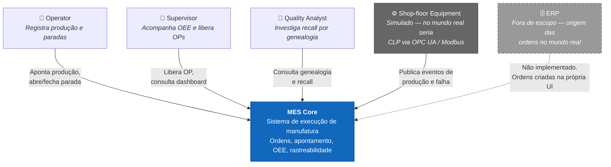

**Leitura para quem nunca viu fábrica** (use este parágrafo no README):

> Numa linha de produção, o ERP diz *o que* produzir e o MES controla *como está
> sendo* produzido: quanto já saiu, quanto foi refugado, quanto tempo a máquina
> ficou parada e por quê, e de quais lotes de matéria-prima cada lote produzido
> veio. Quando um cliente reclama de um lote, é o MES que responde
> "essa matéria-prima também foi para estes outros 40 lotes" em segundos.

---

### 6. C4 Nível 2 — Containers

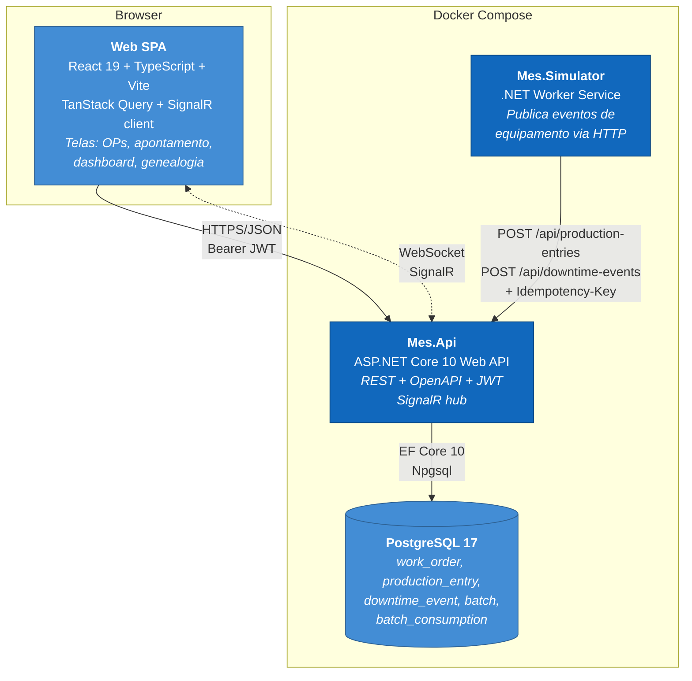

#### 6.1 Camadas internas da API (monólito modular)

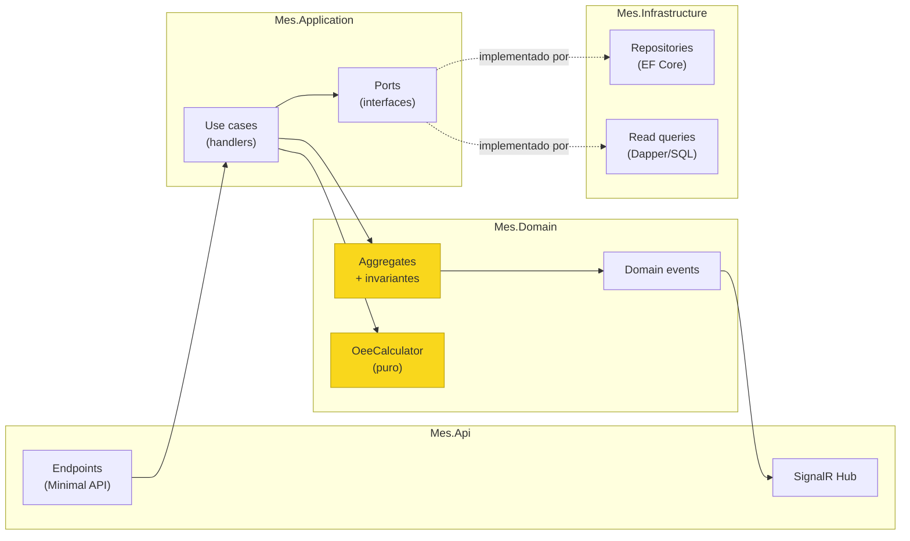

**Regra de dependência:** `Domain` não referencia nada. `Application` referencia
`Domain`. `Infrastructure` e `Api` referenciam `Application` e `Domain`.
`Domain` **não conhece EF Core** — isso é o que torna `OeeCalculator` e as
transições de estado testáveis sem banco, e é o ponto de maior contraste com o
legado (onde a regra vive dentro de package Oracle).

**Escrita vs leitura:** comandos passam por agregado + EF Core (invariantes
garantidas). Consultas de relatório (OEE, genealogia) usam SQL direto via Dapper
— CTE recursiva e agregação por janela de tempo não têm por que passar por
ChangeTracker. Isso é CQRS *leve*: dois caminhos de leitura/escrita no mesmo
banco, sem event sourcing, sem projeções assíncronas. Decisão registrada no ADR-003.

---

### 7. Fluxo de evento: simulador → dashboard

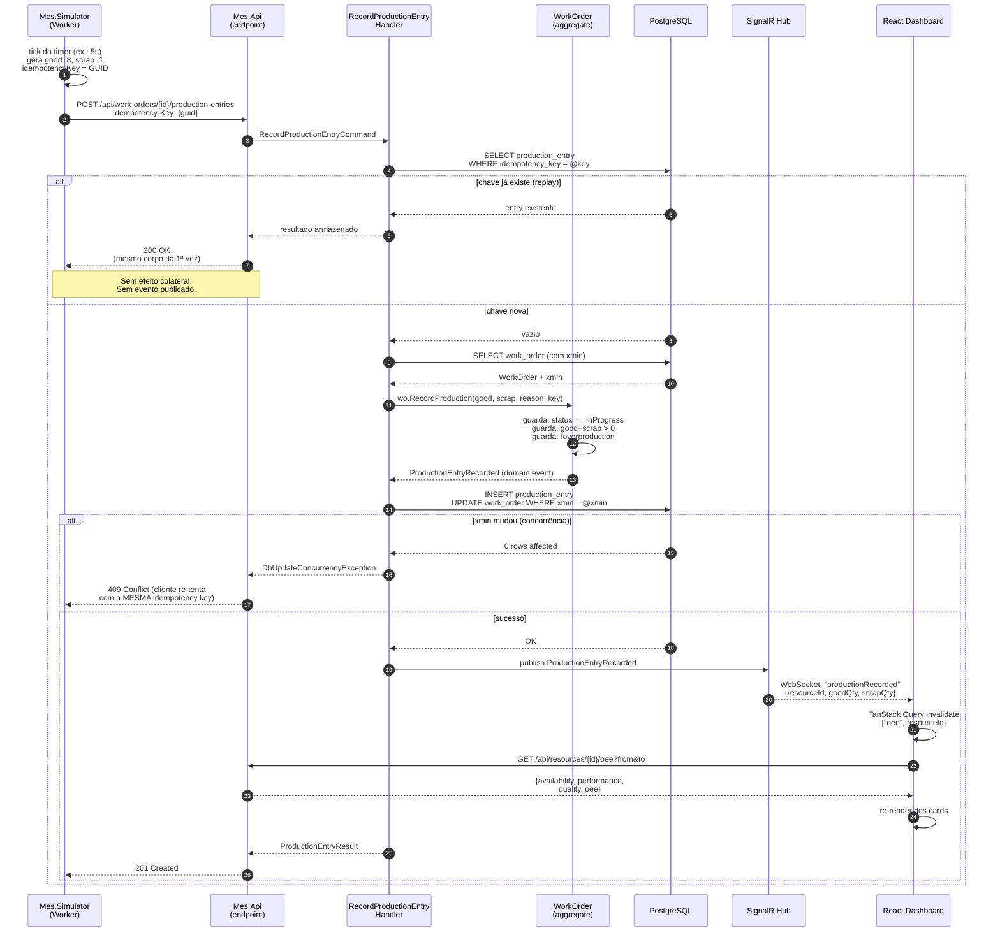

**Decisão de design visível no diagrama:** o SignalR **notifica** ("algo mudou no
recurso X"), não **carrega dado** ("o OEE agora é 0,73"). O cliente invalida a
query e refetch. Isso evita duas fontes de verdade de cálculo e mantém o OEE
sempre derivado do mesmo caminho, testado uma vez só. É um padrão que dá uma
resposta muito boa quando o entrevistador pergunta "como você garante que o
tempo real não divirja da consulta?".

---

## Data Models

### 8. Modelo de domínio (entidades, agregados, invariantes)

#### 8.1 Agregados

| Agregado | Raiz | Entidades internas | Fronteira transacional |
|---|---|---|---|
| **Work Order** | `WorkOrder` | `ProductionEntry` | Um apontamento nunca é salvo sem passar pela raiz. A raiz mantém os totais acumulados |
| **Downtime** | `DowntimeEvent` | — | Independente da OP: máquina pode parar sem OP aberta (setup, manutenção) |
| **Batch** | `Batch` | `BatchConsumption` | O consumo pertence ao lote produzido |
| **Resource** | `Resource` | — | Estado do recurso muda por evento, não por escrita direta |
| **Catálogos** | `Product`, `DowntimeReason`, `ScrapReason` | — | CRUD simples |
| **Identity** | `User` | `UserRole` | `Role` e `Permission` são catálogo |

#### 8.2 `WorkOrder` — invariantes

| # | Invariante | Onde é garantida |
|---|---|---|
| WO-1 | `PlannedQuantity > 0` | Construtor / factory |
| WO-2 | `ProducedGoodQuantity + ProducedScrapQuantity == Σ entries` | Método `RecordProduction`, único caminho de escrita |
| WO-3 | Apontamento só é aceito quando `Status == InProgress` | Guarda em `RecordProduction` |
| WO-4 | `ProducedGoodQuantity <= PlannedQuantity * (1 + OverproductionTolerance)` | Guarda em `RecordProduction` (tolerância default 5%) |
| WO-5 | Toda transição de status segue o grafo do §10 | Método privado `TransitionTo` |
| WO-6 | `CompletedAt` só é preenchido em `Completed`/`Cancelled` | Transição |
| WO-7 | `IdempotencyKey` é única dentro da OP | Índice único + guarda no handler |
| WO-8 | Apontamento com `ScrapQuantity > 0` exige `ScrapReasonId` | Guarda em `RecordProduction` |
| WO-9 | `StartedAt <= entry.OccurredAt <= now + clockSkewTolerance` | Guarda em `RecordProduction` |

#### 8.3 `DowntimeEvent` — invariantes

| # | Invariante | Onde |
|---|---|---|
| DT-1 | `EndedAt == null || EndedAt > StartedAt` | Método `Close` |
| DT-2 | No máximo um `DowntimeEvent` aberto por `Resource` | Índice único parcial: `UNIQUE (resource_id) WHERE ended_at IS NULL` |
| DT-3 | `DowntimeReasonId` obrigatório na abertura | Construtor |
| DT-4 | Parada fechada é imutável | Sem setter público após `Close` |

> **Nota sobre DT-2:** o índice único parcial do Postgres resolve a invariante no
> banco, não só na aplicação. Isso importa porque o simulador e o operador podem
> tentar abrir parada simultaneamente. Vale um parágrafo no ADR.

#### 8.4 `Batch` e `BatchConsumption` — invariantes

| # | Invariante | Onde |
|---|---|---|
| B-1 | `Batch.Code` único globalmente | Índice único |
| B-2 | `BatchConsumption` liga `producedBatchId` → `consumedBatchId` com `quantity > 0` | Construtor |
| B-3 | Um lote não pode consumir a si mesmo | Guarda: `producedBatchId != consumedBatchId` |
| B-4 | **O grafo de consumo é acíclico (DAG)** | Verificação no `RegisterConsumption` (§18.5) + `MAX RECURSION DEPTH` na query |
| B-5 | Lote produzido pertence a exatamente uma `WorkOrder` | FK obrigatória |

#### 8.5 `Resource` — estado derivado

`Resource.State` (`Idle` / `Running` / `Down`) é **projeção**, não fonte da verdade:

- `Down` ⟺ existe `DowntimeEvent` aberto para o recurso
- `Running` ⟺ não está `Down` e existe `WorkOrder` em `InProgress` no recurso
- `Idle` ⟺ nenhum dos dois

Persistir a coluna é permitido (para dashboard rápido), mas ela é **cache**: um
teste de integração precisa provar que ela é sempre reconstruível a partir dos
eventos. Essa é uma das armadilhas do MES legado (estado digitado divergindo da
realidade) e vale citar em entrevista.

#### 8.6 Nomes fictícios a usar (restrição R4)

Todos os dados de seed são inventados. **Não reaproveitar nada do sistema real.**

| Tipo | Exemplos a usar no seed |
|---|---|
| Recursos | `LINE-A`, `LINE-B`, `PRESS-01`, `OVEN-02`, `PACK-01` |
| Produtos | `WIDGET-100`, `WIDGET-200`, `BRACKET-50`, `HOUSING-10` |
| Motivos de parada | `SETUP`, `TOOL-CHANGE`, `MATERIAL-SHORTAGE`, `MECH-FAILURE`, `ELEC-FAILURE`, `PLANNED-MAINT` |
| Motivos de refugo | `DIMENSIONAL`, `VISUAL`, `CONTAMINATION`, `ASSEMBLY-ERROR` |
| Lotes | `B-2026-000001` (sequencial) |

---

### 9. Diagrama ER

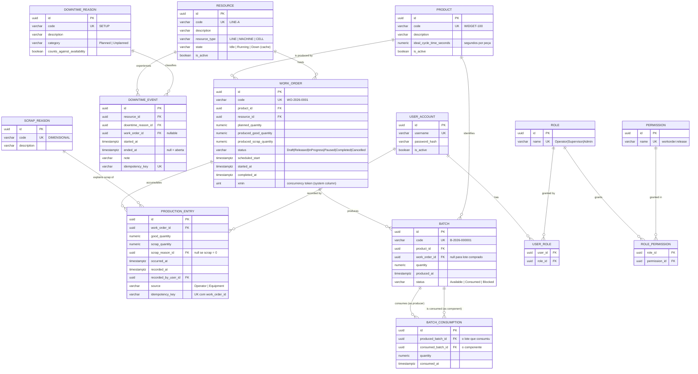

#### 9.1 Índices que importam (e por quê)

| Índice | Motivo |
|---|---|
| `UNIQUE (work_order_id, idempotency_key)` em `production_entry` | Idempotência garantida no banco, não só na app (§19) |
| `UNIQUE (resource_id) WHERE ended_at IS NULL` em `downtime_event` | Invariante DT-2 (uma parada aberta por recurso) |
| `(resource_id, started_at DESC)` em `downtime_event` | Query de OEE varre paradas por recurso e janela |
| `(work_order_id, occurred_at)` em `production_entry` | Query de OEE e histórico de apontamento |
| `(consumed_batch_id)` em `batch_consumption` | Genealogia forward (recall) — sem ele o recall faz seq scan a cada nível da recursão |
| `(produced_batch_id)` em `batch_consumption` | Genealogia backward |
| `UNIQUE (code)` em `batch`, `work_order`, `product`, `resource` | Chave natural de negócio |

> Ponto de entrevista: o índice em `consumed_batch_id` é o que faz a diferença
> entre um recall que responde em 50 ms e um que responde em 30 s. Saber apontar
> *qual* índice e *por que* é sinal de Pleno.

---

### 10. Máquina de estados da Work Order

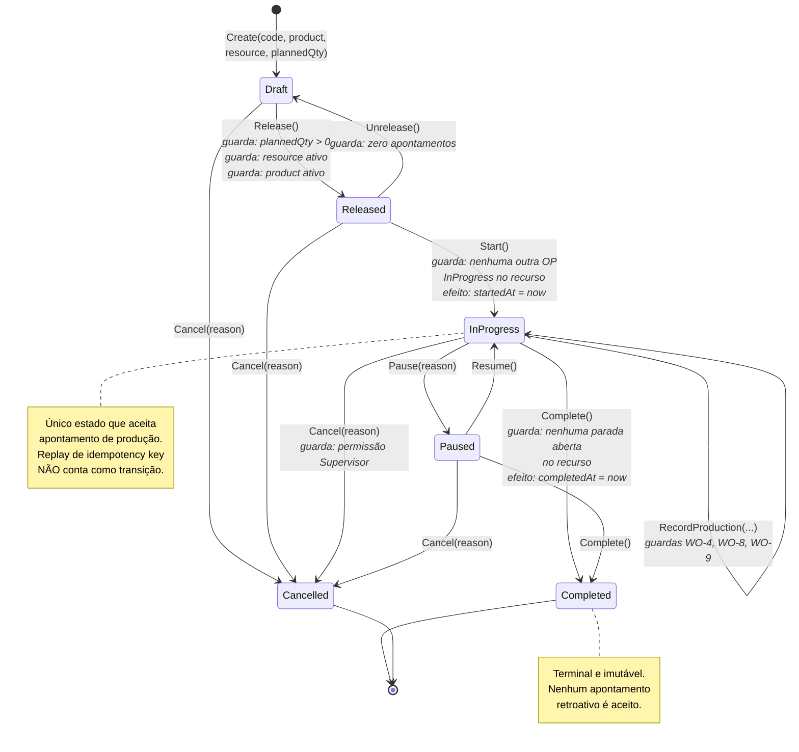

#### 10.1 Matriz de transição (fonte da verdade para os testes)

`✔` permitido · `✖` rejeitado com `InvalidStateTransitionException`

| De \ Ação | `Release` | `Unrelease` | `Start` | `RecordProduction` | `Pause` | `Resume` | `Complete` | `Cancel` |
|---|---|---|---|---|---|---|---|---|
| `Draft` | ✔ | ✖ | ✖ | ✖ | ✖ | ✖ | ✖ | ✔ |
| `Released` | ✖ | ✔¹ | ✔ | ✖ | ✖ | ✖ | ✖ | ✔ |
| `InProgress` | ✖ | ✖ | ✖ | ✔ | ✔ | ✖ | ✔² | ✔ |
| `Paused` | ✖ | ✖ | ✖ | ✖ | ✖ | ✔ | ✔² | ✔ |
| `Completed` | ✖ | ✖ | ✖ | ✖ | ✖ | ✖ | ✖ | ✖ |
| `Cancelled` | ✖ | ✖ | ✖ | ✖ | ✖ | ✖ | ✖ | ✖ |

¹ apenas se `entries.Count == 0`
² apenas se não houver `DowntimeEvent` aberto no recurso

Esta matriz é literalmente o caso de teste: um teste parametrizado percorre
6 estados × 8 ações = **48 combinações**, e cada uma tem resultado esperado
declarado. É a forma mais barata de cobertura alta com valor real. Ver §25 (P-7).

---

## Components and Interfaces

### 11. Stack e ferramentas — justificativa item por item

Esta seção é a sua **cola de entrevista**. Cada linha tem o "por quê" e a
alternativa que você conscientemente descartou. Um Pleno não escolhe ferramenta,
escolhe *tradeoff*.

#### 11.1 Backend

| Escolha | Por que | Alternativa descartada e motivo |
|---|---|---|
| **.NET 10 / C# 14** | LTS mais recente; é o ecossistema que você já domina — o portfólio não deve gastar o orçamento de aprendizado na linguagem | Node/NestJS: jogaria fora sua vantagem. Java/Spring: aprender stack nova no mesmo projeto em que se aprende React é excesso |
| **Minimal API** (não Controllers) | Endpoint como função explícita, menos cerimônia, fácil de ler no GitHub. Um avaliador lê o arquivo de endpoint e entende o contrato em 30 s | MVC Controllers: seria repetir o que o legado já faz; sem ganho de sinal |
| **Vertical slice por feature** | Cada caso de uso é uma pasta com command + handler + validator + endpoint. Contraste direto com o `Repository.cs` duplicado por área do legado | Camadas horizontais puras: espalha um caso de uso por 5 pastas |
| **EF Core 10 + Npgsql** para escrita | Migrations versionadas, change tracking, e `xmin` como token de concorrência sem coluna extra | Dapper para tudo: perde migrations e o controle de concorrência fica manual |
| **Dapper** para leitura de relatório | CTE recursiva de genealogia e agregação de OEE são SQL. Forçar isso em LINQ produz SQL pior e código ilegível | LINQ puro: CTE recursiva em EF Core exige raw SQL de qualquer forma |
| **FluentValidation** | Validação de entrada (DTO) separada de invariante de domínio. Distinguir os dois é uma pergunta clássica de entrevista | DataAnnotations: insuficiente para regras compostas |
| **Serilog** + structured logging | Log com propriedades (`workOrderId`, `resourceId`) é pesquisável. Log de string não é | `ILogger` cru: sem sink estruturado configurado |
| **JWT Bearer** (`Microsoft.AspNetCore.Authentication.JwtBearer`) | Padrão para SPA + API. Demonstra emissão, claims de role e autorização por policy | Cookie auth: acopla SPA e API no mesmo domínio, menos demonstrativo |
| **SignalR** | Push do servidor para o dashboard. É a stack .NET nativa, você já usou circuito SignalR no Blazor | SSE: menos capaz. Polling: não demonstra nada de novo |
| **`BackgroundService`** para o simulador | Worker em processo separado, comunicando pela **mesma API pública**. Prova que a API é o único caminho de escrita | Simulador escrevendo direto no banco: burla as invariantes e vale zero |
| **OpenAPI** (`Microsoft.AspNetCore.OpenApi`) + Scalar UI | Contrato navegável no `/scalar`. É a primeira coisa que um avaliador abre | Swashbuckle: ainda válido, mas o nativo do .NET 10 é o caminho atual |
| **PostgreSQL 17** | Ver R2. Além disso: `xmin`, CTE recursiva, índice único parcial, `timestamptz` | Oracle: peso e licença. SQL Server: container grande, sem `xmin` |

#### 11.2 Frontend (deliberadamente pequeno)

| Escolha | Por que | Alternativa descartada |
|---|---|---|
| **React 19 + TypeScript** | Padrão de mercado internacional; TypeScript porque tipagem é o que te deixa produtivo vindo de C# | Blazor: já provado. Vue/Svelte: menor demanda nas vagas-alvo |
| **Vite** | Dev server instantâneo, build simples, zero configuração de webpack | CRA: obsoleto. Next.js: SSR não agrega nada aqui e adiciona conceitos |
| **TanStack Query** | Cache, invalidação e refetch de estado de servidor. Resolve 90% do que as pessoas usam Redux para fazer | Redux Toolkit: **explicitamente descartado** — este app quase não tem estado de cliente |
| **React Router** | Navegação. Nada exótico | — |
| **Tailwind CSS** ou **Mantine** | Escolha uma e siga. UI decente rápido, sem gastar sprint em CSS | CSS artesanal: consome tempo que deveria ir para o backend |
| **Recharts** | Gráfico de OEE e Pareto de paradas. API declarativa simples | D3 puro: overkill |
| **`@microsoft/signalr`** | Cliente oficial do hub | — |
| **Vitest + React Testing Library** | Alguns testes de componente nos formulários críticos. Não persiga cobertura no front | Jest: mais lento com Vite |
| **`openapi-typescript`** | Gera os tipos TS a partir do OpenAPI da API. Contrato compartilhado sem duplicação manual | Tipos escritos à mão: divergem em duas semanas |

#### 11.3 Testes

| Escolha | Por que |
|---|---|
| **xUnit** | Padrão de fato no ecossistema .NET |
| **FluentAssertions** | Falha legível: `result.Oee.Should().BeInRange(0, 1)` |
| **FsCheck** (ou **CsCheck**) | **Property-based testing** — o diferencial. As propriedades do §25 são o que separa este portfólio de um CRUD |
| **Testcontainers for .NET** | Postgres real, efêmero, por execução de teste. Testa a CTE recursiva e o índice único de verdade — não contra InMemory, que mente |
| **`WebApplicationFactory`** | Teste de integração ponta a ponta pelo HTTP real |
| **Bogus** | Dados de seed fictícios (respeitando R4) |

> **Por que Testcontainers e não `UseInMemoryDatabase`:** o InMemory não tem
> índice único parcial, não tem CTE recursiva, não tem `xmin`. Ou seja: ele não
> testa exatamente as três coisas mais interessantes deste projeto. Dizer isso em
> entrevista é ouro.

#### 11.4 Infraestrutura e processo

| Escolha | Por que |
|---|---|
| **Docker + Docker Compose** | `docker compose up` → API, DB, frontend, simulador. Requisito não negociável |
| **GitHub Actions** | CI: restore → build → test → lint front → docker build. Badge verde no README |
| **Conventional Commits** | Histórico legível. Avaliador olha `git log` |
| **ADRs em `docs/adr/`** | 3–5 documentos curtos (1 página). Prova que você registra decisão, não só escreve código |
| **`.editorconfig` + analyzers + `TreatWarningsAsErrors`** | Qualidade automática, sem discussão de estilo |
| **Mermaid nos `.md`** | O GitHub renderiza. Diagrama que vive no repositório não fica obsoleto |

---

### 12. Estrutura da solução .NET

```
mes-core/
├─ README.md                        # domínio explicado + como rodar + screenshots
├─ LICENSE                          # MIT
├─ docker-compose.yml
├─ .editorconfig
├─ Directory.Build.props            # Nullable, TreatWarningsAsErrors, LangVersion
├─ .github/workflows/ci.yml
├─ docs/
│  ├─ adr/
│  │  ├─ 0001-modular-monolith-over-microservices.md
│  │  ├─ 0002-postgresql-over-oracle.md
│  │  ├─ 0003-light-cqrs-ef-write-dapper-read.md
│  │  ├─ 0004-idempotency-key-on-production-entry.md
│  │  └─ 0005-oee-derived-from-events.md
│  └─ domain-primer.md              # MES para quem nunca viu fábrica
├─ src/
│  ├─ Mes.Domain/                          # ZERO dependências externas
│  │  ├─ Common/
│  │  │  ├─ Entity.cs
│  │  │  ├─ AggregateRoot.cs
│  │  │  ├─ IDomainEvent.cs
│  │  │  └─ DomainException.cs
│  │  ├─ WorkOrders/
│  │  │  ├─ WorkOrder.cs                   # raiz + invariantes WO-1..WO-9
│  │  │  ├─ WorkOrderStatus.cs
│  │  │  ├─ ProductionEntry.cs
│  │  │  ├─ WorkOrderTransitions.cs        # matriz do §10.1 como tabela estática
│  │  │  └─ Events/ProductionEntryRecorded.cs
│  │  ├─ Downtimes/
│  │  │  ├─ DowntimeEvent.cs
│  │  │  ├─ DowntimeReason.cs
│  │  │  └─ Events/{DowntimeStarted,DowntimeClosed}.cs
│  │  ├─ Oee/
│  │  │  ├─ OeeCalculator.cs               # FUNÇÃO PURA — o coração testável
│  │  │  ├─ OeeResult.cs
│  │  │  ├─ OeeInput.cs
│  │  │  ├─ TimeInterval.cs                # value object + merge de sobreposição
│  │  │  └─ Shift.cs
│  │  ├─ Traceability/
│  │  │  ├─ Batch.cs
│  │  │  └─ BatchConsumption.cs
│  │  ├─ Resources/{Resource.cs,ResourceState.cs}
│  │  ├─ Catalog/{Product.cs,ScrapReason.cs}
│  │  └─ Identity/{User.cs,Role.cs,Permission.cs}
│  │
│  ├─ Mes.Application/                     # referencia Domain
│  │  ├─ Abstractions/
│  │  │  ├─ IWorkOrderRepository.cs
│  │  │  ├─ IDowntimeRepository.cs
│  │  │  ├─ IBatchRepository.cs
│  │  │  ├─ IOeeQueryService.cs             # port de leitura
│  │  │  ├─ IGenealogyQueryService.cs
│  │  │  ├─ IUnitOfWork.cs
│  │  │  ├─ IClock.cs                       # tempo injetável — testes determinísticos
│  │  │  └─ IRealtimeNotifier.cs            # port do SignalR
│  │  ├─ WorkOrders/
│  │  │  ├─ CreateWorkOrder/{Command,Handler,Validator}.cs
│  │  │  ├─ ReleaseWorkOrder/...
│  │  │  ├─ StartWorkOrder/...
│  │  │  ├─ RecordProductionEntry/          # ← idempotência + concorrência vivem aqui
│  │  │  │  ├─ RecordProductionEntryCommand.cs
│  │  │  │  ├─ RecordProductionEntryHandler.cs
│  │  │  │  ├─ RecordProductionEntryValidator.cs
│  │  │  │  └─ RecordProductionEntryResult.cs
│  │  │  └─ CompleteWorkOrder/...
│  │  ├─ Downtimes/{StartDowntime,CloseDowntime}/...
│  │  ├─ Oee/GetResourceOee/{Query,Handler}.cs
│  │  ├─ Traceability/
│  │  │  ├─ RegisterBatchConsumption/...
│  │  │  ├─ GetBatchGenealogyBackward/...
│  │  │  ├─ GetBatchGenealogyForward/...
│  │  │  └─ GetRecallImpact/...
│  │  └─ Labels/GenerateBatchQrCode/...
│  │
│  ├─ Mes.Infrastructure/                  # referencia Application + Domain
│  │  ├─ Persistence/
│  │  │  ├─ MesDbContext.cs
│  │  │  ├─ Configurations/*.cs             # IEntityTypeConfiguration por agregado
│  │  │  ├─ Migrations/
│  │  │  ├─ Repositories/*.cs
│  │  │  └─ Seed/SeedData.cs                # nomes fictícios do §8.6
│  │  ├─ Queries/
│  │  │  ├─ OeeQueryService.cs              # SQL do §17
│  │  │  └─ GenealogyQueryService.cs        # CTE recursiva do §18
│  │  ├─ Identity/{JwtTokenService.cs,PasswordHasher.cs}
│  │  ├─ Realtime/SignalRNotifier.cs
│  │  └─ Labels/QrCodeGenerator.cs
│  │
│  ├─ Mes.Api/                             # host
│  │  ├─ Program.cs
│  │  ├─ Endpoints/
│  │  │  ├─ WorkOrderEndpoints.cs
│  │  │  ├─ DowntimeEndpoints.cs
│  │  │  ├─ OeeEndpoints.cs
│  │  │  ├─ TraceabilityEndpoints.cs
│  │  │  ├─ CatalogEndpoints.cs
│  │  │  └─ AuthEndpoints.cs
│  │  ├─ Hubs/ShopFloorHub.cs
│  │  ├─ Middleware/ProblemDetailsMiddleware.cs
│  │  ├─ Dockerfile
│  │  └─ appsettings.json
│  │
│  └─ Mes.Simulator/                       # worker
│     ├─ Program.cs
│     ├─ EquipmentSimulator.cs             # BackgroundService
│     ├─ SimulatorOptions.cs               # taxa, refugo, MTBF, MTTR
│     └─ Dockerfile
│
├─ tests/
│  ├─ Mes.Domain.UnitTests/
│  │  ├─ WorkOrders/WorkOrderTransitionTests.cs      # matriz 6×8 do §10.1
│  │  ├─ WorkOrders/RecordProductionTests.cs
│  │  ├─ Oee/OeeCalculatorTests.cs                   # exemplos + casos de borda
│  │  └─ Oee/TimeIntervalMergeTests.cs
│  ├─ Mes.Domain.PropertyTests/                      # FsCheck — §25
│  │  ├─ OeeProperties.cs
│  │  ├─ WorkOrderProperties.cs
│  │  └─ Generators/MesArbitraries.cs
│  └─ Mes.Api.IntegrationTests/                      # Testcontainers
│     ├─ MesApiFixture.cs
│     ├─ IdempotencyTests.cs
│     ├─ ConcurrencyTests.cs
│     ├─ GenealogyTests.cs
│     └─ OeeEndpointTests.cs
│
└─ web/                                              # ver §13
```

**Detalhe que vale ponto:** `IClock` como port. Todo cálculo de OEE e toda
transição de estado consulta `IClock.UtcNow`, nunca `DateTime.UtcNow`. Sem isso,
os testes de janela de tempo são não determinísticos. É a primeira coisa que um
entrevistador sênior procura quando o assunto é "como você testa cálculo por
período".

---

### 13. Estrutura do frontend React

Pequeno de propósito. Nove arquivos de página, não noventa.

```
web/
├─ package.json
├─ vite.config.ts
├─ tsconfig.json
├─ Dockerfile
├─ .env.example                       # VITE_API_BASE_URL
├─ src/
│  ├─ main.tsx
│  ├─ App.tsx                         # rotas + QueryClientProvider
│  ├─ api/
│  │  ├─ client.ts                    # fetch wrapper: baseUrl, JWT, ProblemDetails
│  │  ├─ schema.d.ts                  # GERADO por openapi-typescript
│  │  └─ hooks/
│  │     ├─ useWorkOrders.ts          # useQuery / useMutation
│  │     ├─ useProductionEntry.ts     # gera Idempotency-Key no cliente
│  │     ├─ useDowntimes.ts
│  │     ├─ useResourceOee.ts
│  │     └─ useGenealogy.ts
│  ├─ realtime/
│  │  ├─ signalr.ts                   # conexão + reconexão
│  │  └─ useShopFloorEvents.ts        # invalida queries por evento recebido
│  ├─ pages/
│  │  ├─ LoginPage.tsx
│  │  ├─ DashboardPage.tsx            # cards de OEE + estado dos recursos + Pareto
│  │  ├─ WorkOrderListPage.tsx
│  │  ├─ WorkOrderDetailPage.tsx      # ações da máquina de estados + histórico
│  │  ├─ ProductionEntryPage.tsx      # tela do operador: teclado grande, poucos campos
│  │  ├─ DowntimePage.tsx             # abrir/fechar parada
│  │  ├─ GenealogyPage.tsx            # árvore forward/backward
│  │  ├─ RecallPage.tsx               # busca reversa
│  │  └─ CatalogPage.tsx              # CRUD dos 4 catálogos, tabela genérica
│  ├─ components/
│  │  ├─ OeeCard.tsx                  # A × P × Q → OEE, com tooltip da fórmula
│  │  ├─ ResourceStateBadge.tsx
│  │  ├─ DowntimeParetoChart.tsx
│  │  ├─ GenealogyTree.tsx
│  │  ├─ StatusTransitionButtons.tsx  # só mostra ações permitidas pelo status
│  │  └─ ProblemDetailsAlert.tsx
│  └─ auth/{AuthContext.tsx,RequirePermission.tsx}
└─ tests/
   ├─ ProductionEntryPage.test.tsx    # idempotency-key é enviada e reusada no retry
   └─ OeeCard.test.tsx
```

**Duas escolhas de front que valem comentar em entrevista:**

1. `useProductionEntry` gera a `Idempotency-Key` **no cliente**, uma vez por
   tentativa lógica, e **reusa a mesma chave no retry**. Se a chave fosse gerada
   por request, o retry duplicaria a produção. Este é o bug clássico de
   idempotência mal implementada, e o teste em `ProductionEntryPage.test.tsx`
   existe justamente para provar que você não caiu nele.
2. `StatusTransitionButtons` deriva os botões da matriz de transição, não de
   `if`s espalhados. A regra vive num lugar só, espelhando o domínio.

---

## Testing Strategy

### 14. Estratégia de testes

#### 14.1 Pirâmide, com peso proposital

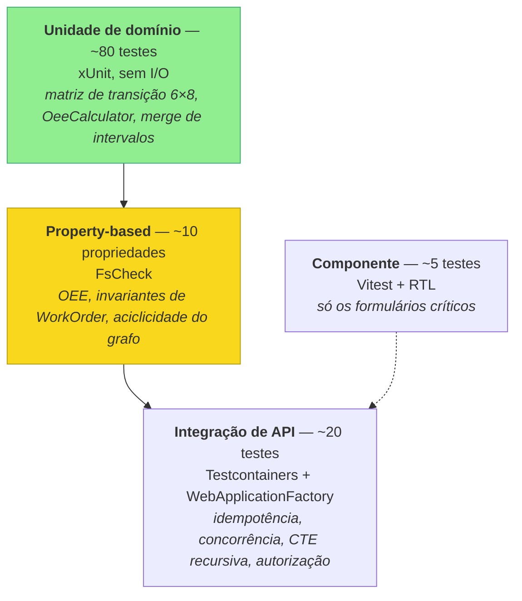

**Alvo:** cobertura alta em `Mes.Domain` (>90%), moderada em `Application`,
baixa e intencional no frontend. Não persiga número global — persiga **os dois
lugares onde erro custa caro**: OEE e transição de estado.

#### 14.2 Unidade (`Mes.Domain.UnitTests`)

Sem banco, sem HTTP, sem mock de repositório (o domínio não conhece repositório).

```csharp
// Matriz de transição — 48 casos gerados a partir de uma tabela declarativa
[Theory]
[MemberData(nameof(TransitionMatrix))]
public void Transition_respects_state_machine(
    WorkOrderStatus from, WorkOrderAction action, bool expectedAllowed)
{
    var wo = WorkOrderTestBuilder.InStatus(from);
    var act = () => wo.Apply(action);

    if (expectedAllowed) act.Should().NotThrow();
    else act.Should().Throw<InvalidStateTransitionException>();
}
```

Casos de borda obrigatórios do `OeeCalculator` (cada um é um teste nomeado):
`PlannedTimeZero`, `NoProduction`, `DowntimeExceedsPlannedTime`,
`OverlappingDowntimes`, `DowntimeCrossingWindowBoundary`, `RetroactiveEntry`,
`PerformanceAboveOne`, `AllScrap`, `ZeroIdealCycleTime`.

#### 14.3 Property-based (`Mes.Domain.PropertyTests`)

O diferencial. Ver §25 para a lista completa de propriedades. Exemplo:

```csharp
[Property(MaxTest = 500)]
public Property Oee_is_always_within_zero_and_one(OeeInput input)
    => (OeeCalculator.Calculate(input) is { HasData: true } r
            ? r.Oee >= 0m && r.Oee <= 1m
            : true)
       .ToProperty();
```

Gerador customizado em `MesArbitraries.cs`: gera janelas de tempo válidas,
paradas possivelmente sobrepostas, apontamentos com quantidades não negativas.
**Escrever o gerador é o exercício que ensina o que é um input válido do sistema.**

#### 14.4 Integração (`Mes.Api.IntegrationTests`)

Postgres real via Testcontainers, migrations aplicadas por fixture, API real via
`WebApplicationFactory`. Os testes que não podem faltar:

| Teste | Prova |
|---|---|
| `Replaying_same_idempotency_key_does_not_duplicate` | 5 POSTs com a mesma chave → 1 registro, 1× `201` + 4× `200`, totais inalterados |
| `Same_key_with_different_payload_returns_409` | Uso indevido da chave é rejeitado |
| `Concurrent_entries_on_same_work_order_do_not_lose_updates` | 20 tarefas paralelas → soma dos totais igual à soma dos aceitos; nenhum `lost update` |
| `Only_one_open_downtime_per_resource` | Índice único parcial dispara |
| `Backward_genealogy_returns_full_ancestry` | CTE recursiva multi-nível |
| `Recall_forward_finds_all_affected_batches` | Busca reversa em grafo de 3 níveis com ramificação |
| `Cyclic_consumption_is_rejected` | Guarda B-4 |
| `Operator_cannot_release_work_order` | RBAC por policy |
| `Oee_endpoint_matches_calculator` | Query SQL e calculador puro concordam |

> `Oee_endpoint_matches_calculator` merece destaque: ele garante que a
> implementação SQL (rápida) e a implementação C# (testada por propriedades)
> produzem o mesmo número. É como você compra performance sem perder a garantia.

#### 14.5 O que **não** testar

Getters, mapeamento de DTO, configuração de EF Core, componentes de layout do
front. Teste sem valor é dívida de manutenção — e cortar teste inútil com
justificativa é sinal de maturidade.

---

## 15. Estratégia de deploy e CI

### 15.1 `docker compose up` — o requisito de dois minutos

```yaml
# docker-compose.yml (esboço)
services:
  db:
    image: postgres:17-alpine
    environment:
      POSTGRES_DB: mes
      POSTGRES_PASSWORD: mes_dev_only
    healthcheck:
      test: ["CMD-SHELL", "pg_isready -U postgres"]
      interval: 5s
    volumes: [mes-data:/var/lib/postgresql/data]

  api:
    build: { context: ., dockerfile: src/Mes.Api/Dockerfile }
    depends_on:
      db: { condition: service_healthy }
    environment:
      ConnectionStrings__Default: "Host=db;Database=mes;Username=postgres;Password=mes_dev_only"
      Mes__ApplyMigrationsOnStartup: "true"
      Mes__SeedDemoData: "true"
    ports: ["8080:8080"]

  web:
    build: { context: ./web }
    depends_on: [api]
    ports: ["5173:80"]

  simulator:
    build: { context: ., dockerfile: src/Mes.Simulator/Dockerfile }
    depends_on: [api]
    environment:
      Simulator__ApiBaseUrl: "http://api:8080"
      Simulator__Enabled: "true"

volumes: { mes-data: }
```

**Regras que fazem isso funcionar de verdade:**
- Migrations aplicadas no startup **apenas** quando `ApplyMigrationsOnStartup=true`
  (dev/demo). Em "produção" seria job separado — comentar isso no README mostra
  que você sabe a diferença.
- Seed de demonstração popula catálogos, 3 recursos, algumas OPs e um grafo de
  lotes com 3 níveis. O avaliador abre o dashboard e **já vê número**, não tela vazia.
- Simulador começa habilitado, então o dashboard se move sozinho nos primeiros
  30 segundos. Esse é o momento "wow" da avaliação.
- `healthcheck` no Postgres: sem ele, a API sobe antes do banco e falha. Erro
  clássico que faz o avaliador desistir na primeira tentativa.

### 15.2 Pipeline (`.github/workflows/ci.yml`)

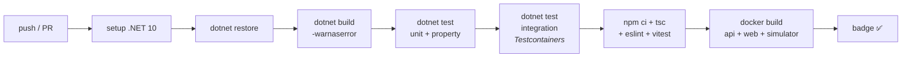

Detalhes: cache de NuGet e npm; `--collect:"XPlat Code Coverage"` com relatório
no summary do job; Testcontainers funciona no runner `ubuntu-latest` sem
configuração extra. Badge do workflow no topo do README.

### 15.3 Deploy opcional (só se sobrar energia)

Não é requisito. Se quiser um link vivo: API em container no Fly.io ou Azure
Container Apps, Postgres gerenciado (Neon/Supabase), frontend em Vercel/Netlify.
**Prioridade baixa** — um `docker compose up` confiável vale mais que um deploy
frágil que o avaliador encontra fora do ar.

---

## 16. Segurança

Escopo de portfólio, mas sem fazer bobagem que um revisor perceba.

| Item | Decisão |
|---|---|
| Senha | `PasswordHasher` com **Argon2id** ou PBKDF2 do ASP.NET Core Identity. Nunca MD5/SHA1 sem salt |
| Token | JWT HS256, expiração 60 min, claims `sub`, `role`, `permissions` |
| Segredo de assinatura | Variável de ambiente. `appsettings.json` tem valor só de dev, com comentário explícito. **Nada de segredo real no repositório** |
| Autorização | Policy por permissão, não por role no endpoint: `.RequireAuthorization("workorder:release")`. Papel mapeia para permissões no seed |
| Endpoints públicos | Só `POST /api/auth/login` e `/health`. Todo o resto exige token — **inclusive os do simulador** (ele autentica com uma conta de serviço) |
| CORS | Origem explícita do frontend, não `AllowAnyOrigin` |
| SQL | Sempre parametrizado, inclusive nas CTEs em Dapper. Zero interpolação de string em SQL |
| Erro | `ProblemDetails` (RFC 9457) sem stack trace em produção. Mensagens em inglês, sem detalhe interno |
| Rate limit | `AddRateLimiter` no endpoint de login (janela fixa). Barato e demonstra atenção |
| Dependências | Versões pinadas; `dependabot.yml` habilitado |

> Ponto forte a mencionar: **o simulador autentica como qualquer outro cliente**.
> Não existe caminho privilegiado de escrita. Isso significa que a superfície de
> escrita do sistema é exatamente a API pública — testável e auditável.

---

# Parte II — Low-Level Design

## 17. Algoritmo: cálculo de OEE a partir de eventos

### 17.1 Por que "a partir de eventos" é a decisão central do projeto

No MES legado, indicadores tendem a ser campos preenchidos: alguém digita
"disponibilidade 87%". O número existe, ninguém sabe de onde veio, e quando
divergem do chão de fábrica não há como reconciliar.

Aqui o OEE é uma **função pura** de três conjuntos de eventos:

```
OEE = f(janela de tempo, paradas do recurso, apontamentos de produção, tempo de ciclo ideal)
```

Não há coluna `oee` em nenhuma tabela. Sempre recalculável, sempre auditável,
sempre explicável para o operador ("seu OEE caiu porque a parada de 40 min por
`TOOL-CHANGE` derrubou a disponibilidade"). Esta é a decisão do **ADR-005**.

### 17.2 Definição de cada termo

| Termo | Símbolo | Definição precisa | Unidade |
|---|---|---|---|
| Janela de análise | `[W₀, W₁)` | Intervalo requisitado. Semiaberto: início inclusivo, fim exclusivo | — |
| Tempo total da janela | `T_total` | `W₁ − W₀` | segundos |
| Tempo não programado | `T_unsched` | Soma dos trechos da janela fora de qualquer turno definido | segundos |
| **Tempo planejado de produção** | `T_planned` | `T_total − T_unsched` | segundos |
| Tempo de parada contável | `T_down` | Duração da **união** (não da soma) das paradas com `counts_against_availability = true`, recortadas na janela e intersectadas com turno | segundos |
| **Tempo de operação** | `T_run` | `max(0, T_planned − T_down)` | segundos |
| Peças boas | `Q_good` | Σ `good_quantity` dos apontamentos com `occurred_at ∈ [W₀, W₁)` | peças |
| Peças refugadas | `Q_scrap` | Σ `scrap_quantity` idem | peças |
| Peças totais | `Q_total` | `Q_good + Q_scrap` | peças |
| Tempo de ciclo ideal | `C_ideal` | `product.ideal_cycle_time_seconds` | s/peça |
| **Disponibilidade** | `A` | `T_run / T_planned` | 0..1 |
| **Performance** | `P` | `(C_ideal × Q_total) / T_run` | 0..1 (clampado) |
| **Qualidade** | `Q` | `Q_good / Q_total` | 0..1 |
| **OEE** | — | `A × P × Q` | 0..1 |

**Escolha explícita:** `Performance` usa `Q_total` (produção total, boa + refugo),
não só `Q_good`. Razão: a máquina gastou ciclo para produzir a peça refugada
também. A perda de qualidade é contabilizada uma vez, no fator `Q`. Se `P` usasse
`Q_good`, o refugo seria penalizado duas vezes. Isso é a definição canônica do
OEE (Nakajima) e é exatamente o tipo de detalhe que separa quem leu o conceito de
quem copiou fórmula da internet.

### 17.3 Casos de borda — tabela de decisão

| Caso | Condição | Comportamento |
|---|---|---|
| **Tempo planejado zero** | `T_planned == 0` | Retorna `OeeResult.NoData`. `A`, `P`, `Q`, `OEE` = `null`. **Não** retorna 0 — 0 significaria "máquina péssima", `null` significa "não havia produção programada". Distinção crítica para o supervisor |
| **Sem produção** | `Q_total == 0` | `A` calculado normalmente; `P = 0`; `Q = null` (não existe qualidade sem peça); `OEE = 0`. Um turno inteiro parado tem OEE 0, não `null` |
| **Paradas sobrepostas** | Dois `DowntimeEvent` com interseção | Usa **união de intervalos** (merge), nunca soma. Somar contaria o mesmo minuto duas vezes e poderia gerar `T_down > T_planned` |
| **Parada cruzando a borda da janela** | `started_at < W₀` ou `ended_at > W₁` | Recorta (`clamp`) no limite da janela antes de somar |
| **Parada aberta** | `ended_at == null` | Trata como `ended_at = min(now, W₁)`. Uma parada em curso conta até agora |
| **Parada maior que o planejado** | `T_down > T_planned` | `T_run = 0` → `A = 0`, `P = 0`, `OEE = 0`. Nunca tempo negativo. Se acontecer, loga warning: indica parada fora de turno mal classificada |
| **Apontamento retroativo** | Apontamento inserido com `occurred_at` no passado, dentro de janela já consultada | Sem tratamento especial — não há cache de OEE. Consulta seguinte já reflete. É o benefício direto de não persistir o indicador. `occurred_at` é o que classifica na janela, **nunca** `recorded_at` |
| **Performance > 1** | Produziu mais rápido que o ciclo ideal | `P` é clampado em `1.0` **e** o resultado carrega `PerformanceWasClamped = true`. Significa que o `ideal_cycle_time` do produto está mal cadastrado — o flag transforma o dado ruim em informação, em vez de esconder |
| **Ciclo ideal zero ou nulo** | `C_ideal <= 0` | `P = null`, `OEE = null`, `Reason = "MissingIdealCycleTime"`. Não estimar — dado faltante é dado faltante |
| **Turno não definido** | Nenhum `Shift` configurado para o recurso | `T_unsched = 0` → `T_planned = T_total` (janela 24×7). Comportamento default documentado |
| **Janela invertida** | `W₁ <= W₀` | `ArgumentException`. Erro de programação, não de dado |
| **Múltiplos produtos na janela** | Recurso rodou OPs de produtos diferentes | `C_ideal` é ponderado por produto: `P = Σ(C_ideal_i × Q_total_i) / T_run`. Um único `C_ideal` estaria errado |

### 17.4 Merge de intervalos (base de `T_down`)

```pascal
ALGORITHM MergeAndMeasure(intervals, window)
INPUT:  intervals — lista de TimeInterval (podem se sobrepor, podem extrapolar a janela)
        window    — TimeInterval [W0, W1)
OUTPUT: totalSeconds — duração da UNIÃO dos intervalos, recortada na janela

BEGIN
  // 1. Recorta cada intervalo na janela; descarta os que não intersectam
  clipped ← []
  FOR each iv IN intervals DO
    start ← MAX(iv.Start, window.Start)
    end   ← MIN(iv.EndOrNow, window.End)      // parada aberta → EndOrNow = min(now, W1)
    IF start < end THEN
      clipped.Add(TimeInterval(start, end))
    END IF
  END FOR

  IF clipped IS EMPTY THEN RETURN 0 END IF

  // 2. Ordena por início
  SORT clipped BY Start ASCENDING

  // 3. Varredura linear acumulando a união
  total       ← 0
  currentStart ← clipped[0].Start
  currentEnd   ← clipped[0].End

  FOR i ← 1 TO clipped.Count - 1 DO
    // INVARIANTE DE LOOP:
    //   (a) total = duração da união de clipped[0..i-1] MENOS o bloco corrente
    //   (b) [currentStart, currentEnd) é o bloco fundido corrente, e
    //       currentStart <= clipped[i].Start   (garantido pela ordenação)
    //   (c) total >= 0 e total <= window.Duration
    iv ← clipped[i]
    IF iv.Start <= currentEnd THEN
      currentEnd ← MAX(currentEnd, iv.End)     // sobrepõe ou encosta → estende
    ELSE
      total ← total + (currentEnd - currentStart)   // fecha o bloco
      currentStart ← iv.Start
      currentEnd   ← iv.End
    END IF
  END FOR

  total ← total + (currentEnd - currentStart)        // fecha o último bloco

  ASSERT total >= 0
  ASSERT total <= window.DurationSeconds
  RETURN total
END
```

**Precondições:** `window.Start < window.End`; todo `iv.Start <= iv.EndOrNow`.
**Postcondições:** `0 <= resultado <= window.DurationSeconds`; resultado é
monotônico crescente ao adicionar intervalos; resultado é independente da ordem
de entrada (idempotente a permutações). Cada uma dessas três é uma propriedade
testável — ver §25 (P-9, P-10).

### 17.5 Algoritmo principal

```pascal
ALGORITHM CalculateOee(input)
INPUT:  input : OeeInput = {
          Window            : TimeInterval,
          Shifts            : list of TimeInterval,        // trechos programados
          Downtimes         : list of DowntimeSlice,       // {Interval, CountsAgainstAvailability}
          ProductionByProduct : list of ProductionSlice,   // {GoodQty, ScrapQty, IdealCycleTimeSeconds}
          Now               : timestamp
        }
OUTPUT: OeeResult = { HasData, Availability, Performance, Quality, Oee,
                      PlannedSeconds, DownSeconds, RunSeconds,
                      GoodQuantity, ScrapQuantity,
                      PerformanceWasClamped, Reason }

BEGIN
  // ── PRECONDIÇÕES ─────────────────────────────────────────────
  IF input.Window.End <= input.Window.Start THEN
    RAISE ArgumentException("window end must be after window start")
  END IF
  ASSERT ALL p IN input.ProductionByProduct : p.GoodQty >= 0 AND p.ScrapQty >= 0

  // ── PASSO 1: tempo planejado de produção ─────────────────────
  IF input.Shifts IS EMPTY THEN
    plannedSeconds ← input.Window.DurationSeconds          // default 24x7
  ELSE
    plannedSeconds ← MergeAndMeasure(input.Shifts, input.Window)
  END IF

  IF plannedSeconds = 0 THEN
    RETURN OeeResult.NoData(reason ← "NoPlannedProductionTime")
  END IF

  // ── PASSO 2: tempo de parada contável (união, recortada) ─────
  countable ← [ d.Interval FOR d IN input.Downtimes
                            WHERE d.CountsAgainstAvailability ]
  // recorta também contra os turnos: parada fora de turno não penaliza
  IF input.Shifts IS NOT EMPTY THEN
    countable ← IntersectWithShifts(countable, input.Shifts)
  END IF
  downSeconds ← MergeAndMeasure(countable, input.Window)

  IF downSeconds > plannedSeconds THEN
    LOG WARNING "downtime exceeds planned time — check shift classification"
    downSeconds ← plannedSeconds                           // clamp defensivo
  END IF

  // ── PASSO 3: tempo de operação ───────────────────────────────
  runSeconds ← plannedSeconds - downSeconds
  ASSERT runSeconds >= 0 AND runSeconds <= plannedSeconds

  // ── PASSO 4: quantidades ─────────────────────────────────────
  goodQty  ← SUM(p.GoodQty  FOR p IN input.ProductionByProduct)
  scrapQty ← SUM(p.ScrapQty FOR p IN input.ProductionByProduct)
  totalQty ← goodQty + scrapQty

  // ── PASSO 5: Availability ────────────────────────────────────
  availability ← runSeconds / plannedSeconds
  ASSERT 0 <= availability <= 1

  // ── PASSO 6: Performance (tempo teórico ponderado por produto) ─
  IF runSeconds = 0 THEN
    performance ← 0
    clamped ← false
  ELSE IF ANY p IN input.ProductionByProduct
           WHERE (p.GoodQty + p.ScrapQty) > 0 AND p.IdealCycleTimeSeconds <= 0 THEN
    RETURN OeeResult.Partial(availability, quality ← ComputeQuality(goodQty, totalQty),
                             reason ← "MissingIdealCycleTime")
  ELSE
    theoreticalSeconds ← SUM( p.IdealCycleTimeSeconds * (p.GoodQty + p.ScrapQty)
                              FOR p IN input.ProductionByProduct )
    performance ← theoreticalSeconds / runSeconds
    clamped ← performance > 1
    IF clamped THEN performance ← 1 END IF
  END IF
  ASSERT 0 <= performance <= 1

  // ── PASSO 7: Quality ─────────────────────────────────────────
  IF totalQty = 0 THEN
    quality ← NULL                                   // não existe qualidade sem peça
    oee     ← 0                                      // mas o OEE do período é 0
  ELSE
    quality ← goodQty / totalQty
    ASSERT 0 <= quality <= 1
    oee ← availability * performance * quality
  END IF

  // ── POSTCONDIÇÕES ────────────────────────────────────────────
  ASSERT oee = NULL OR (0 <= oee AND oee <= 1)
  ASSERT oee = NULL OR oee <= availability
  ASSERT oee = NULL OR oee <= performance
  ASSERT oee = NULL OR (quality = NULL OR oee <= quality)
  ASSERT plannedSeconds = runSeconds + downSeconds

  RETURN OeeResult {
    HasData ← true, Availability ← availability, Performance ← performance,
    Quality ← quality, Oee ← oee,
    PlannedSeconds ← plannedSeconds, DownSeconds ← downSeconds, RunSeconds ← runSeconds,
    GoodQuantity ← goodQty, ScrapQuantity ← scrapQty,
    PerformanceWasClamped ← clamped, Reason ← NULL
  }
END
```

**Precondições:** janela válida; quantidades não negativas; `Shifts` e
`Downtimes` podem ser vazios.
**Postcondições:** todas as `ASSERT` finais acima. Note que
`oee <= min(A, P, Q)` sai de graça do produto de três fatores em `[0,1]` — e é
uma propriedade excelente para property-based testing (P-2).

### 17.6 Assinatura em C#

```csharp
namespace Mes.Domain.Oee;

// Value object — sem dependência de EF Core, sem I/O, sem DateTime.UtcNow
public sealed record TimeInterval(DateTimeOffset Start, DateTimeOffset End)
{
    public double DurationSeconds => (End - Start).TotalSeconds;
    public bool Intersects(TimeInterval other) => Start < other.End && other.Start < End;
    public TimeInterval? ClipTo(TimeInterval window);
}

public sealed record DowntimeSlice(TimeInterval Interval, bool CountsAgainstAvailability);

public sealed record ProductionSlice(
    decimal GoodQuantity,
    decimal ScrapQuantity,
    double IdealCycleTimeSeconds);

public sealed record OeeInput(
    TimeInterval Window,
    IReadOnlyList<TimeInterval> Shifts,
    IReadOnlyList<DowntimeSlice> Downtimes,
    IReadOnlyList<ProductionSlice> ProductionByProduct,
    DateTimeOffset Now);

public sealed record OeeResult
{
    public bool     HasData               { get; init; }
    public decimal? Availability          { get; init; }
    public decimal? Performance           { get; init; }
    public decimal? Quality               { get; init; }
    public decimal? Oee                   { get; init; }
    public double   PlannedSeconds        { get; init; }
    public double   DownSeconds           { get; init; }
    public double   RunSeconds            { get; init; }
    public decimal  GoodQuantity          { get; init; }
    public decimal  ScrapQuantity         { get; init; }
    public bool     PerformanceWasClamped { get; init; }
    public string?  Reason                { get; init; }

    public static OeeResult NoData(string reason);
    public static OeeResult Partial(decimal availability, decimal? quality, string reason);
}

public static class OeeCalculator
{
    /// <summary>Pure function. No I/O, no ambient time. Deterministic for a given input.</summary>
    public static OeeResult Calculate(OeeInput input);

    /// <summary>Union length of the given intervals, clipped to the window, in seconds.</summary>
    internal static double MergeAndMeasure(
        IReadOnlyList<TimeInterval> intervals, TimeInterval window, DateTimeOffset now);
}
```

### 17.7 A consulta que alimenta o calculador

O calculador é puro; quem busca os eventos é a `IOeeQueryService`. SQL (Dapper),
parametrizado:

```sql
-- Downtime slices do recurso na janela (inclui parada aberta)
SELECT  de.started_at                              AS "Start",
        COALESCE(de.ended_at, LEAST(@now, @to))    AS "End",
        dr.counts_against_availability             AS "CountsAgainstAvailability"
FROM    downtime_event de
JOIN    downtime_reason dr ON dr.id = de.downtime_reason_id
WHERE   de.resource_id = @resourceId
  AND   de.started_at < @to
  AND   COALESCE(de.ended_at, @now) > @from;       -- interseção com a janela

-- Production slices agrupados por produto (para o C_ideal ponderado)
SELECT  SUM(pe.good_quantity)          AS "GoodQuantity",
        SUM(pe.scrap_quantity)         AS "ScrapQuantity",
        p.ideal_cycle_time_seconds     AS "IdealCycleTimeSeconds"
FROM    production_entry pe
JOIN    work_order wo ON wo.id = pe.work_order_id
JOIN    product    p  ON p.id  = wo.product_id
WHERE   wo.resource_id = @resourceId
  AND   pe.occurred_at >= @from
  AND   pe.occurred_at <  @to          -- janela SEMIABERTA: sem dupla contagem
GROUP BY p.id, p.ideal_cycle_time_seconds;
```

Duas coisas para notar e saber defender:
- `occurred_at` na cláusula, **nunca** `recorded_at`. Apontamento retroativo tem
  que cair na janela em que a produção aconteceu, não na que foi digitada.
- Janela semiaberta `[from, to)`. Com `<=` no limite superior, um apontamento na
  borda apareceria em duas janelas consecutivas e a soma dos períodos não fecharia
  com o total. Bug real, difícil de achar depois.

---

## 18. Algoritmo: genealogia de lote

### 18.1 O problema, em linguagem de fábrica

Um cliente reclama do lote `B-2026-000420`. Duas perguntas precisam de resposta
em segundos:

1. **Backward (causa raiz):** de quais lotes de matéria-prima ele veio? Em todos
   os níveis, até a compra.
2. **Forward (impacto / recall):** um lote de matéria-prima veio contaminado — que
   lotes produzidos o consumiram, direta ou indiretamente? Quais já foram
   expedidos?

Isso é um **grafo dirigido acíclico**. `batch_consumption` é a lista de arestas:
`produced_batch_id → consumed_batch_id` significa "o lote produzido consumiu o
componente".

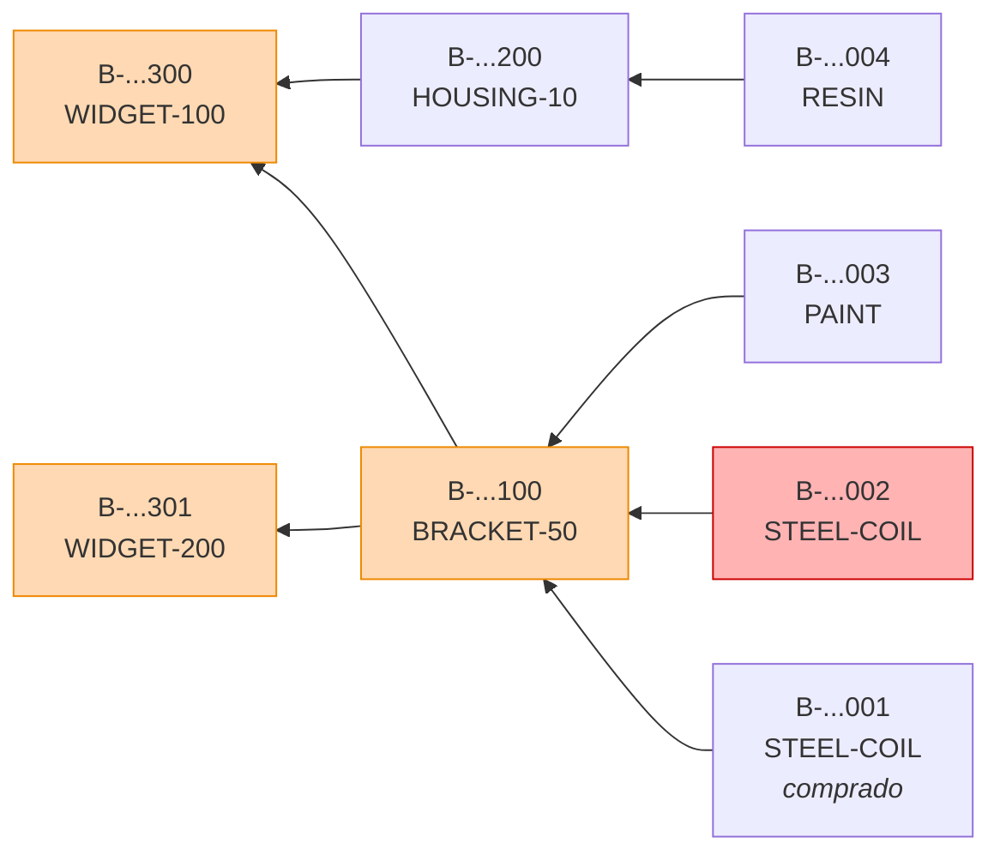

A seta aponta do componente para quem o consumiu. Se `B-...002` está suspeito
(vermelho), o recall alcança `B-...100`, `B-...300` e `B-...301` (laranja).
`B-...200` e `B-...004` ficam de fora — e **não** recolher o que não precisa é
tão valioso quanto recolher o que precisa.

### 18.2 Backward: ancestralidade (CTE recursiva)

```sql
-- Todos os ancestrais de @batchId, com nível e caminho
WITH RECURSIVE ancestry AS (
    -- CASO BASE: consumos diretos do lote alvo
    SELECT  bc.consumed_batch_id        AS batch_id,
            bc.produced_batch_id        AS consumer_batch_id,
            bc.quantity,
            1                           AS depth,
            ARRAY[bc.produced_batch_id, bc.consumed_batch_id] AS path
    FROM    batch_consumption bc
    WHERE   bc.produced_batch_id = @batchId

    UNION ALL

    -- PASSO RECURSIVO: sobe um nível
    SELECT  bc.consumed_batch_id,
            bc.produced_batch_id,
            bc.quantity,
            a.depth + 1,
            a.path || bc.consumed_batch_id
    FROM    batch_consumption bc
    JOIN    ancestry a ON a.batch_id = bc.produced_batch_id
    WHERE   a.depth < @maxDepth                        -- guarda de profundidade
      AND   NOT (bc.consumed_batch_id = ANY(a.path))   -- guarda de ciclo
)
SELECT  a.depth, a.consumer_batch_id, a.batch_id,
        b.code, b.status, b.produced_at, b.quantity AS batch_quantity,
        p.code AS product_code, a.quantity AS consumed_quantity
FROM    ancestry a
JOIN    batch   b ON b.id = a.batch_id
JOIN    product p ON p.id = b.product_id
ORDER BY a.depth, b.code;
```

### 18.3 Forward: recall (mesma estrutura, aresta invertida)

```sql
-- Todos os lotes que consumiram @batchId, direta ou indiretamente
WITH RECURSIVE impact AS (
    SELECT  bc.produced_batch_id        AS batch_id,
            bc.consumed_batch_id        AS source_batch_id,
            1                           AS depth,
            ARRAY[bc.consumed_batch_id, bc.produced_batch_id] AS path
    FROM    batch_consumption bc
    WHERE   bc.consumed_batch_id = @batchId

    UNION ALL

    SELECT  bc.produced_batch_id,
            bc.consumed_batch_id,
            i.depth + 1,
            i.path || bc.produced_batch_id
    FROM    batch_consumption bc
    JOIN    impact i ON i.batch_id = bc.consumed_batch_id
    WHERE   i.depth < @maxDepth
      AND   NOT (bc.produced_batch_id = ANY(i.path))
)
SELECT DISTINCT ON (i.batch_id)
        i.depth, i.batch_id, b.code, b.status, b.produced_at,
        p.code AS product_code, wo.code AS work_order_code
FROM    impact i
JOIN    batch      b  ON b.id  = i.batch_id
JOIN    product    p  ON p.id  = b.product_id
LEFT JOIN work_order wo ON wo.id = b.work_order_id
ORDER BY i.batch_id, i.depth;      -- DISTINCT ON mantém o menor depth por lote
```

**Por que `DISTINCT ON (batch_id) ... ORDER BY batch_id, depth`:** num DAG com
convergência (dois caminhos chegam no mesmo lote), o mesmo lote aparece mais de
uma vez com profundidades diferentes. Para recall, você quer a lista **única** de
lotes afetados, com a distância mais curta. Sem isso, um grafo em diamante gera
duplicata e o relatório de recall mente sobre o volume.

### 18.4 Recursão em SQL vs em memória — o tradeoff

| Critério | CTE recursiva (Postgres) | Recursão em memória (C#) |
|---|---|---|
| Round-trips | 1 | N por nível, ou 1 se carregar tudo |
| Volume trafegado | Só os nós alcançados | Nós alcançados, ou a tabela inteira |
| Performance com grafo profundo | Boa, com índice em `consumed_batch_id` | Degrada com N+1 |
| Testabilidade da lógica | Precisa de Postgres real (Testcontainers) | Teste unitário puro |
| Legibilidade para quem não é DBA | Menor | Maior |
| Detecção de ciclo | `path` array + `NOT ... = ANY(path)` | `HashSet<Guid>` de visitados |
| Limite de profundidade | `depth < @maxDepth` | `if (depth > max) throw` |

**Decisão (ADR-003):** CTE recursiva no Postgres, exposta por
`IGenealogyQueryService`. Motivos: recall é a operação em que latência importa
(alguém está esperando para decidir se para a expedição), e o índice em
`consumed_batch_id` faz o trabalho. O port `IGenealogyQueryService` mantém a
opção aberta e permite um fake em memória nos testes de camadas superiores.

**A construção da árvore** (transformar a lista plana `(depth, parent, child)` em
estrutura aninhada para a UI) acontece **em C#**, e essa parte é testada como
função pura:

```pascal
ALGORITHM BuildTree(flatRows, rootBatchId)
INPUT:  flatRows — lista de {Depth, ParentBatchId, BatchId, ...}, ordenada por Depth
        rootBatchId
OUTPUT: GenealogyNode (raiz com filhos aninhados)

BEGIN
  index ← empty Map<BatchId, GenealogyNode>
  root  ← new GenealogyNode(rootBatchId, depth ← 0)
  index[rootBatchId] ← root
  visited ← { rootBatchId }

  FOR each row IN flatRows DO                 // já ordenado por Depth crescente
    // INVARIANTE: todo nó de profundidade < row.Depth já está em `index`
    parent ← index[row.ParentBatchId]
    IF parent IS NULL THEN CONTINUE END IF    // aresta órfã: ignora, loga

    IF row.BatchId IN visited THEN
      // convergência de DAG: referencia sem recriar subárvore
      parent.Children.Add(NodeReference(row.BatchId))
    ELSE
      node ← new GenealogyNode(row.BatchId, row.Depth, row.Attributes)
      parent.Children.Add(node)
      index[row.BatchId] ← node
      visited.Add(row.BatchId)
    END IF
  END FOR

  ASSERT NoCycles(root)                       // propriedade P-5
  ASSERT root.MaxDepth <= MAX_DEPTH
  RETURN root
END
```

**Precondições:** `flatRows` ordenada por `Depth` ascendente; todo `ParentBatchId`
de profundidade `d` já apareceu como `BatchId` em profundidade `d−1` (ou é a raiz).
**Postcondições:** árvore acíclica; cada `batchId` materializado uma única vez;
convergências viram referência, não cópia (evita explosão exponencial em diamante).
**Invariante de loop:** ao processar uma linha de profundidade `d`, todos os nós de
profundidade `< d` já estão indexados.

### 18.5 Guarda de aciclicidade na escrita

Detectar ciclo só na leitura é tarde. `RegisterBatchConsumption` verifica **antes**
de inserir:

```pascal
ALGORITHM RegisterConsumption(producedBatchId, consumedBatchId, quantity)
BEGIN
  // Guarda B-3: autoconsumo
  IF producedBatchId = consumedBatchId THEN
    RAISE DomainException("a batch cannot consume itself")
  END IF

  IF quantity <= 0 THEN
    RAISE DomainException("consumed quantity must be positive")
  END IF

  // Guarda B-4: a nova aresta criaria ciclo?
  // Ciclo existe se `producedBatchId` já é ancestral de `consumedBatchId`,
  // isto é: se `consumedBatchId` alcança `producedBatchId` seguindo as arestas.
  IF ExistsPath(from ← consumedBatchId, to ← producedBatchId) THEN
    RAISE DomainException("consumption would create a cycle in the genealogy graph")
  END IF

  INSERT batch_consumption(producedBatchId, consumedBatchId, quantity, now())
END
```

`ExistsPath` é uma CTE recursiva com `LIMIT 1` — para no primeiro alcance, não
materializa o grafo. Em Postgres é barato com o índice certo.

> Ponto de entrevista: "por que verificar ciclo na escrita se a leitura já tem
> guarda de `path`?" Resposta: a guarda de leitura evita loop infinito, mas um
> ciclo persistido corrompe o significado do dado — genealogia com ciclo diz que
> um lote é ancestral de si mesmo, e nenhum relatório de recall sobrevive a isso.
> Defesa em profundidade: guarda na escrita (correção) + guarda na leitura
> (robustez).

---

## 19. Idempotência de apontamento

### 19.1 O problema é real, não acadêmico

Três cenários que acontecem toda semana numa fábrica:

1. O operador clica "Apontar" e a tela demora. Ele clica de novo.
2. O coletor de dados (ou o simulador, aqui) envia o POST, o Wi-Fi cai antes da
   resposta chegar, e o cliente re-tenta.
3. Timeout de 30 s no gateway; a requisição **foi processada**, mas o cliente
   recebeu erro e re-tenta.

Sem idempotência, cada um desses vira produção fantasma. Produção fantasma
corrompe estoque, corrompe OEE e destrói a confiança do operador no sistema.
Este é o ponto do projeto mais fácil de explicar para um entrevistador não
técnico e o que melhor demonstra que você conhece o domínio.

### 19.2 A chave

| Aspecto | Decisão |
|---|---|
| Nome do header | `Idempotency-Key` (convenção do Stripe/IETF draft) |
| Formato | GUID v4 como string, ou qualquer string ≤ 100 chars |
| Quem gera | O **cliente**. Uma chave por *intenção de negócio*, reusada em todo retry daquela intenção |
| Escopo de unicidade | `(work_order_id, idempotency_key)` — índice único |
| Obrigatoriedade | **Obrigatório** no POST de apontamento e de parada. Ausente → `400` |
| Retenção | Permanente (a linha do apontamento *é* o registro). Sem tabela separada de idempotência, sem TTL |
| Detecção de uso indevido | Hash do payload é armazenado. Mesma chave + payload diferente → `409` |

**Decisão importante:** não existe tabela `idempotency_record` separada. A própria
`production_entry` guarda a chave, então a atomicidade sai de graça — o INSERT do
apontamento e o registro da chave são a mesma operação. Uma tabela auxiliar exigiria
transação distribuída ou um `outbox`, complexidade desnecessária neste desenho.

### 19.3 Fluxo, com códigos HTTP

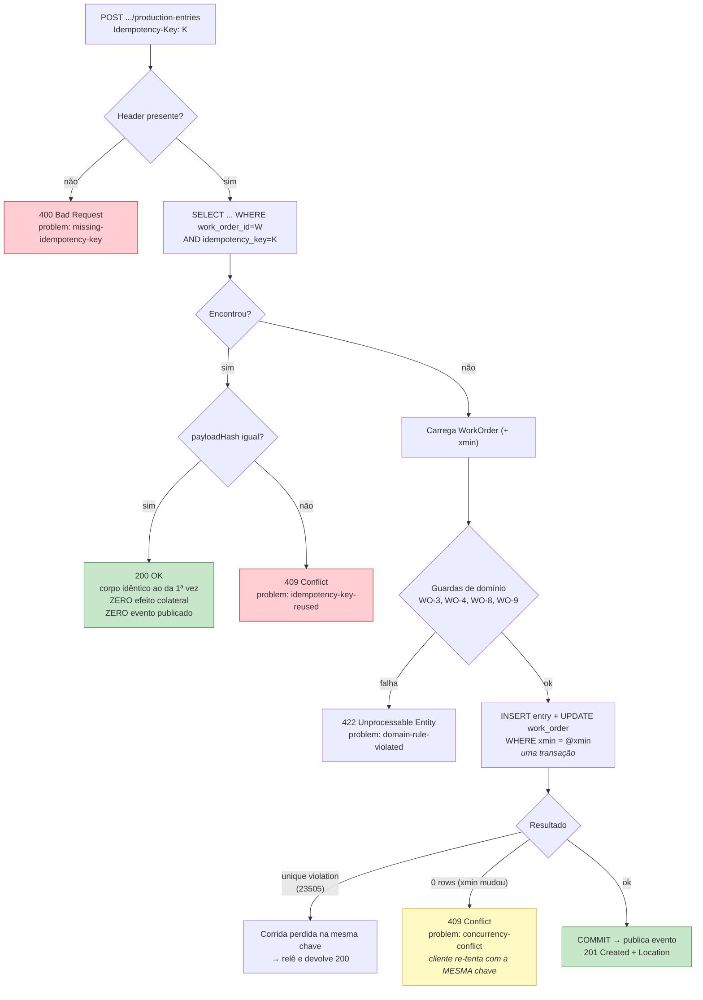

### 19.4 Semântica dos códigos — e por que cada um

| Situação | Código | Por que |
|---|---|---|
| Primeiro POST, aceito | `201 Created` + `Location` | Recurso criado |
| Replay, mesma chave, mesmo payload | `200 OK` | Não criou nada agora; o corpo é o mesmo. **Não** `201`, senão o cliente acha que duplicou. **Não** `409`, senão o retry legítimo parece erro |
| Mesma chave, payload diferente | `409 Conflict` | Uso indevido da chave. Falhar alto é melhor que adivinhar |
| Header ausente | `400 Bad Request` | Contrato exige |
| Regra de domínio violada (OP não `InProgress`, superprodução, refugo sem motivo) | `422 Unprocessable Entity` | Sintaxe válida, semântica inválida |
| Conflito de concorrência (`xmin` mudou) | `409 Conflict` + `Retry-After: 0` | Retry com a **mesma chave** é seguro e esperado |
| Corrida de INSERT na mesma chave (`23505`) | `200 OK` | Duas threads, mesma chave: uma insere, a outra relê e devolve o resultado. Nunca `500` |

O último caso é o detalhe fino: tratar `PostgresException.SqlState == "23505"`
(unique violation) no índice de idempotência **como replay**, não como erro. É a
diferença entre uma implementação de idempotência que parece certa e uma que é
certa sob concorrência.

### 19.5 Handler (C#, forma final)

```csharp
namespace Mes.Application.WorkOrders.RecordProductionEntry;

public sealed record RecordProductionEntryCommand(
    Guid     WorkOrderId,
    decimal  GoodQuantity,
    decimal  ScrapQuantity,
    Guid?    ScrapReasonId,
    DateTimeOffset OccurredAt,
    string   IdempotencyKey,
    ProductionSource Source,
    Guid     UserId);

public sealed record RecordProductionEntryResult(
    Guid    EntryId,
    Guid    WorkOrderId,
    decimal WorkOrderGoodTotal,
    decimal WorkOrderScrapTotal,
    WorkOrderStatus Status,
    bool    WasReplay);      // true → o endpoint responde 200 em vez de 201

public sealed class RecordProductionEntryHandler
{
    // Preconditions:
    //   cmd.IdempotencyKey is non-empty, length <= 100
    //   cmd.GoodQuantity >= 0, cmd.ScrapQuantity >= 0, sum > 0
    //   cmd.ScrapQuantity > 0  =>  cmd.ScrapReasonId is not null
    // Postconditions:
    //   Exactly one production_entry exists for (WorkOrderId, IdempotencyKey)
    //   WorkOrder totals equal the sum over all its entries        (invariant WO-2)
    //   WasReplay = true  =>  no state change, no domain event published
    //   Calling N times with the same command yields the same result and the
    //   same persisted state as calling it once                    (property P-6)
    // Throws:
    //   NotFoundException            — work order does not exist
    //   IdempotencyConflictException — same key, different payload      -> 409
    //   DomainException              — invariant violated               -> 422
    //   DbUpdateConcurrencyException — xmin changed during the update   -> 409
    public Task<RecordProductionEntryResult> HandleAsync(
        RecordProductionEntryCommand cmd, CancellationToken ct);
}
```

### 19.6 Cálculo do hash de payload

```csharp
// Canonicaliza os campos que definem a INTENÇÃO. `recordedAt` e `userId` ficam fora
// de propósito: o mesmo apontamento re-tentado 3 s depois pelo mesmo operador é o
// mesmo apontamento, e não deve virar 409.
private static string ComputePayloadHash(RecordProductionEntryCommand cmd)
{
    var canonical = string.Join('|',
        cmd.WorkOrderId.ToString("N"),
        cmd.GoodQuantity.ToString("F6", CultureInfo.InvariantCulture),
        cmd.ScrapQuantity.ToString("F6", CultureInfo.InvariantCulture),
        cmd.ScrapReasonId?.ToString("N") ?? "-",
        cmd.OccurredAt.ToUniversalTime().ToString("O"));

    return Convert.ToHexString(SHA256.HashData(Encoding.UTF8.GetBytes(canonical)));
}
```

Escolher **o que entra no hash** é a parte que exige julgamento, e é uma boa
pergunta para o entrevistador fazer. Regra: entra o que define a intenção de
negócio; fica fora o que é metadado de transporte.

---

## 20. Transições da máquina de estados com guardas e invariantes

### 20.1 Tabela declarativa (a fonte da verdade no código)

```csharp
namespace Mes.Domain.WorkOrders;

public enum WorkOrderAction { Release, Unrelease, Start, RecordProduction, Pause, Resume, Complete, Cancel }

internal static class WorkOrderTransitions
{
    // (from, action) -> to.   Ausência da chave = transição proibida.
    private static readonly FrozenDictionary<(WorkOrderStatus, WorkOrderAction), WorkOrderStatus> Map =
        new Dictionary<(WorkOrderStatus, WorkOrderAction), WorkOrderStatus>
        {
            [(Draft,      Release)]          = Released,
            [(Draft,      Cancel)]           = Cancelled,
            [(Released,   Unrelease)]        = Draft,
            [(Released,   Start)]            = InProgress,
            [(Released,   Cancel)]           = Cancelled,
            [(InProgress, RecordProduction)] = InProgress,   // self-loop
            [(InProgress, Pause)]            = Paused,
            [(InProgress, Complete)]         = Completed,
            [(InProgress, Cancel)]           = Cancelled,
            [(Paused,     Resume)]           = InProgress,
            [(Paused,     Complete)]         = Completed,
            [(Paused,     Cancel)]           = Cancelled,
        }.ToFrozenDictionary();

    public static bool IsAllowed(WorkOrderStatus from, WorkOrderAction action) => Map.ContainsKey((from, action));

    public static WorkOrderStatus Target(WorkOrderStatus from, WorkOrderAction action) =>
        Map.TryGetValue((from, action), out var to)
            ? to
            : throw new InvalidStateTransitionException(from, action);
}
```

Uma tabela, não uma cascata de `switch`. Consequências práticas: o teste
parametrizado do §14.2 gera as 48 combinações direto do `enum`; o endpoint
`GET /api/work-orders/{id}/allowed-actions` devolve as ações válidas, e o
frontend habilita botões a partir disso, sem duplicar a regra.

### 20.2 Guardas por transição

| Transição | Guarda | Erro se falhar |
|---|---|---|
| `Draft → Released` | `PlannedQuantity > 0` | `422 planned-quantity-must-be-positive` |
| | `Resource.IsActive` | `422 resource-inactive` |
| | `Product.IsActive` | `422 product-inactive` |
| `Released → Draft` | `Entries.Count == 0` | `422 cannot-unrelease-with-entries` |
| `Released → InProgress` | nenhuma outra OP `InProgress` no mesmo `Resource` | `409 resource-busy` |
| `InProgress → InProgress` (apontamento) | `Good + Scrap > 0` | `422 empty-production-entry` |
| | `Scrap > 0 ⇒ ScrapReasonId != null` | `422 scrap-reason-required` |
| | `Good_total_novo <= Planned × (1 + Tolerance)` | `422 overproduction-not-allowed` |
| | `StartedAt <= OccurredAt <= Now + 5 min` | `422 occurred-at-out-of-range` |
| `InProgress → Completed` | nenhum `DowntimeEvent` aberto no `Resource` | `409 open-downtime-must-be-closed` |
| `* → Cancelled` | permissão `workorder:cancel` (papel `Supervisor`+) | `403` |

Notas de projeto:
- `OverproductionTolerance` é **5% por default, configurável por produto**. Rejeitar
  qualquer excesso irrita o operador (a última caixa quase sempre tem peça extra);
  aceitar qualquer valor perde o controle. Tolerância explícita é a resposta madura.
- Os 5 min de folga em `OccurredAt` cobrem desvio de relógio entre coletor e
  servidor. Sem isso, um coletor 20 s adiantado tem apontamento rejeitado. Detalhe
  que só quem viveu integração OT conhece — e você viveu.

### 20.3 Método de aplicação no agregado

```csharp
public sealed class WorkOrder : AggregateRoot
{
    private readonly List<ProductionEntry> _entries = [];

    public string          Code                     { get; private set; }
    public Guid            ProductId                { get; private set; }
    public Guid            ResourceId               { get; private set; }
    public decimal         PlannedQuantity          { get; private set; }
    public decimal         ProducedGoodQuantity     { get; private set; }
    public decimal         ProducedScrapQuantity    { get; private set; }
    public WorkOrderStatus Status                   { get; private set; }
    public DateTimeOffset? StartedAt                { get; private set; }
    public DateTimeOffset? CompletedAt              { get; private set; }
    public decimal         OverproductionTolerance  { get; private set; } = 0.05m;
    public IReadOnlyList<ProductionEntry> Entries => _entries;

    // Preconditions:  Status == InProgress
    //                 goodQty >= 0, scrapQty >= 0, goodQty + scrapQty > 0
    //                 scrapQty > 0 => scrapReasonId is not null
    //                 StartedAt <= occurredAt <= now + clockSkewTolerance
    //                 ProducedGoodQuantity + goodQty <= PlannedQuantity * (1 + OverproductionTolerance)
    //                 no existing entry with the same idempotencyKey
    // Postconditions: _entries.Count == old + 1
    //                 ProducedGoodQuantity  == old + goodQty
    //                 ProducedScrapQuantity == old + scrapQty
    //                 invariant WO-2 holds
    //                 exactly one ProductionEntryRecorded event is raised
    //                 Status is unchanged (InProgress)
    public ProductionEntry RecordProduction(
        decimal goodQty, decimal scrapQty, Guid? scrapReasonId,
        DateTimeOffset occurredAt, string idempotencyKey,
        ProductionSource source, Guid userId, DateTimeOffset now);

    // Postconditions: Status == Released; nothing else changed
    public void Release(Resource resource, Product product);

    // Preconditions:  no other InProgress work order on the same resource (checked by caller)
    // Postconditions: Status == InProgress; StartedAt == now (only set once)
    public void Start(DateTimeOffset now);

    public void Pause(string? note);
    public void Resume();

    // Preconditions:  no open downtime on the resource (checked by caller)
    // Postconditions: Status == Completed; CompletedAt == now; aggregate is immutable afterwards
    public void Complete(DateTimeOffset now);

    public void Cancel(string reason, DateTimeOffset now);

    public IReadOnlySet<WorkOrderAction> AllowedActions();

    private void TransitionTo(WorkOrderAction action) =>
        Status = WorkOrderTransitions.Target(Status, action);
}
```

Nota sobre `Start` e `Complete`: as guardas que dependem de *outros* agregados
(recurso ocupado, parada aberta) são verificadas pelo **handler**, não pelo
agregado. O agregado não faz I/O e não conhece repositório. Manter essa linha
limpa é o que faz os testes de domínio rodarem em milissegundos, e é uma pergunta
de entrevista frequente ("onde você põe uma regra que precisa consultar outro
agregado?").

---

## 21. Assinaturas dos serviços de domínio

```csharp
// ─── Mes.Domain/Oee ───────────────────────────────────────────────────────────
public static class OeeCalculator
{
    public static OeeResult Calculate(OeeInput input);
}

// ─── Mes.Domain/Downtimes ────────────────────────────────────────────────────
public sealed class DowntimeEvent : AggregateRoot
{
    public Guid            ResourceId       { get; private set; }
    public Guid            DowntimeReasonId { get; private set; }
    public Guid?           WorkOrderId      { get; private set; }
    public DateTimeOffset  StartedAt        { get; private set; }
    public DateTimeOffset? EndedAt          { get; private set; }
    public bool            IsOpen           => EndedAt is null;

    // Preconditions:  reasonId exists; startedAt <= now + clockSkewTolerance
    //                 no open downtime for resourceId (enforced by unique partial index)
    // Postconditions: IsOpen == true; DowntimeStarted event raised
    public static DowntimeEvent Open(
        Guid resourceId, Guid reasonId, Guid? workOrderId,
        DateTimeOffset startedAt, string? note, string idempotencyKey);

    // Preconditions:  IsOpen == true; endedAt > StartedAt
    // Postconditions: IsOpen == false; DurationSeconds > 0; aggregate immutable; DowntimeClosed raised
    public void Close(DateTimeOffset endedAt);

    public double DurationSeconds(DateTimeOffset now);
}

// ─── Mes.Domain/Traceability ─────────────────────────────────────────────────
public sealed class Batch : AggregateRoot
{
    public string          Code        { get; private set; }
    public Guid            ProductId   { get; private set; }
    public Guid?           WorkOrderId { get; private set; }
    public decimal         Quantity    { get; private set; }
    public BatchStatus     Status      { get; private set; }
    public DateTimeOffset  ProducedAt  { get; private set; }

    public static Batch Produce(string code, Guid productId, Guid workOrderId,
                                decimal quantity, DateTimeOffset producedAt);
    public static Batch Purchase(string code, Guid productId, decimal quantity,
                                 DateTimeOffset receivedAt);
    public void Block(string reason);     // usado no recall
}

public sealed class BatchConsumption : Entity
{
    // Preconditions:  producedBatchId != consumedBatchId          (B-3)
    //                 quantity > 0
    //                 no path consumedBatchId -> producedBatchId  (B-4, verificado pelo handler)
    public static BatchConsumption Create(Guid producedBatchId, Guid consumedBatchId,
                                          decimal quantity, DateTimeOffset consumedAt);
}

// ─── Mes.Application/Abstractions — ports ────────────────────────────────────
public interface IClock { DateTimeOffset UtcNow { get; } }

public interface IOeeQueryService
{
    Task<OeeInput> BuildInputAsync(Guid resourceId, TimeInterval window, CancellationToken ct);
}

public interface IGenealogyQueryService
{
    Task<IReadOnlyList<GenealogyRow>> GetAncestryAsync(Guid batchId, int maxDepth, CancellationToken ct);
    Task<IReadOnlyList<GenealogyRow>> GetImpactAsync  (Guid batchId, int maxDepth, CancellationToken ct);
    Task<bool> ExistsPathAsync(Guid fromBatchId, Guid toBatchId, CancellationToken ct);
}

public interface IWorkOrderRepository
{
    Task<WorkOrder?>       GetByIdAsync(Guid id, CancellationToken ct);
    Task<ProductionEntry?> FindEntryByIdempotencyKeyAsync(Guid workOrderId, string key, CancellationToken ct);
    Task<bool>             HasInProgressOnResourceAsync(Guid resourceId, Guid excludingWorkOrderId, CancellationToken ct);
    void Add(WorkOrder workOrder);
}

public interface IDowntimeRepository
{
    Task<DowntimeEvent?> GetOpenByResourceAsync(Guid resourceId, CancellationToken ct);
    Task<bool>           HasOpenAsync(Guid resourceId, CancellationToken ct);
    void Add(DowntimeEvent downtime);
}

public interface IRealtimeNotifier
{
    Task ProductionRecordedAsync(Guid resourceId, Guid workOrderId, CancellationToken ct);
    Task DowntimeChangedAsync   (Guid resourceId, bool isOpen,      CancellationToken ct);
    Task WorkOrderStatusChangedAsync(Guid workOrderId, WorkOrderStatus status, CancellationToken ct);
}

public interface IUnitOfWork
{
    Task<int> SaveChangesAsync(CancellationToken ct);   // publica domain events após COMMIT
}
```

**Detalhe do `IUnitOfWork`:** eventos de domínio são publicados **depois** do
commit, não antes. Publicar antes significa notificar o dashboard de uma produção
que a transação pode ainda desfazer. É um bug sutil e comum.

---

## 22. Contratos de API

Base: `/api`. Autenticação `Bearer` em tudo, exceto `POST /api/auth/login` e
`GET /health`. Erros sempre em `application/problem+json` (RFC 9457).

### 22.1 Auth

| Método | Rota | Corpo | Resposta | Permissão |
|---|---|---|---|---|
| `POST` | `/api/auth/login` | `{ username, password }` | `200 { accessToken, expiresAt, permissions[] }` · `401` | pública |
| `GET` | `/api/auth/me` | — | `200 { userId, username, roles[], permissions[] }` | autenticado |

### 22.2 Catálogos (`Product`, `Resource`, `DowntimeReason`, `ScrapReason`)

Padrão idêntico para os quatro. Exemplo com `products`:

| Método | Rota | Resposta | Permissão |
|---|---|---|---|
| `GET` | `/api/products?search=&page=1&pageSize=50` | `200 { items[], total, page, pageSize }` | `catalog:read` |
| `GET` | `/api/products/{id}` | `200` · `404` | `catalog:read` |
| `POST` | `/api/products` | `201 + Location` · `409 duplicate-code` · `422` | `catalog:write` |
| `PUT` | `/api/products/{id}` | `204` · `404` · `422` | `catalog:write` |
| `DELETE` | `/api/products/{id}` | `204` (soft delete → `is_active=false`) · `409 in-use` | `catalog:write` |

### 22.3 Work Orders

| Método | Rota | Corpo | Resposta | Permissão |
|---|---|---|---|---|
| `GET` | `/api/work-orders?status=&resourceId=&page=` | — | `200 { items[], total }` | `workorder:read` |
| `GET` | `/api/work-orders/{id}` | — | `200 WorkOrderDetail` · `404` | `workorder:read` |
| `GET` | `/api/work-orders/{id}/allowed-actions` | — | `200 { actions: ["Start","Cancel"] }` | `workorder:read` |
| `POST` | `/api/work-orders` | `{ code, productId, resourceId, plannedQuantity, scheduledStart }` | `201` · `409 duplicate-code` · `422` | `workorder:write` |
| `POST` | `/api/work-orders/{id}/release` | — | `204` · `409` · `422` | `workorder:release` |
| `POST` | `/api/work-orders/{id}/unrelease` | — | `204` · `422 cannot-unrelease-with-entries` | `workorder:release` |
| `POST` | `/api/work-orders/{id}/start` | — | `204` · `409 resource-busy` · `422` | `workorder:execute` |
| `POST` | `/api/work-orders/{id}/pause` | `{ note? }` | `204` · `422` | `workorder:execute` |
| `POST` | `/api/work-orders/{id}/resume` | — | `204` · `422` | `workorder:execute` |
| `POST` | `/api/work-orders/{id}/complete` | — | `204` · `409 open-downtime-must-be-closed` | `workorder:execute` |
| `POST` | `/api/work-orders/{id}/cancel` | `{ reason }` | `204` · `422` | `workorder:cancel` |

**Escolha de design:** ações são sub-recursos `POST`, não `PATCH { status }`.
Motivo: `PATCH { status: "Completed" }` sugere que o cliente decide o estado.
`POST /complete` expressa uma **intenção**, e o servidor decide se é válida. Isso
mantém a máquina de estados no servidor, onde ela pertence.

### 22.4 Production Entries (endpoint idempotente)

```http
POST /api/work-orders/{workOrderId}/production-entries
Authorization: Bearer <jwt>
Idempotency-Key: 8f14e45f-ea0c-4b1f-9d3a-1c2b7e5a9d01
Content-Type: application/json

{
  "goodQuantity":  8,
  "scrapQuantity": 1,
  "scrapReasonId": "3f2504e0-4f89-11d3-9a0c-0305e82c3301",
  "occurredAt":    "2026-03-14T13:45:02Z",
  "source":        "Equipment"
}
```

```http
201 Created
Location: /api/work-orders/{workOrderId}/production-entries/{entryId}

{
  "entryId":             "b7c1...",
  "workOrderId":         "a1f2...",
  "goodQuantity":        8,
  "scrapQuantity":       1,
  "workOrderGoodTotal":  248,
  "workOrderScrapTotal": 12,
  "status":              "InProgress",
  "wasReplay":           false
}
```

| Cenário | Status | `problem.type` (sufixo) |
|---|---|---|
| Aceito | `201` | — |
| Replay idêntico | `200` (`wasReplay: true`) | — |
| Header ausente | `400` | `missing-idempotency-key` |
| Mesma chave, payload diferente | `409` | `idempotency-key-reused` |
| Conflito de concorrência | `409` + `Retry-After: 0` | `concurrency-conflict` |
| OP não `InProgress` | `422` | `work-order-not-in-progress` |
| `good + scrap == 0` | `422` | `empty-production-entry` |
| Refugo sem motivo | `422` | `scrap-reason-required` |
| Superprodução acima da tolerância | `422` | `overproduction-not-allowed` |
| `occurredAt` fora da janela válida | `422` | `occurred-at-out-of-range` |
| OP inexistente | `404` | `work-order-not-found` |

| Método | Rota | Resposta |
|---|---|---|
| `GET` | `/api/work-orders/{id}/production-entries?page=` | `200 { items[], total }` |

### 22.5 Downtime Events

| Método | Rota | Corpo | Resposta |
|---|---|---|---|
| `POST` | `/api/resources/{resourceId}/downtimes` (header `Idempotency-Key`) | `{ downtimeReasonId, startedAt, workOrderId?, note? }` | `201` · `200` replay · `409 resource-already-down` · `422` |
| `POST` | `/api/downtimes/{id}/close` | `{ endedAt }` | `204` · `422 downtime-already-closed` · `422 ended-before-started` |
| `GET` | `/api/resources/{resourceId}/downtimes?from=&to=` | — | `200 { items[] }` |
| `GET` | `/api/resources/{resourceId}/downtimes/open` | — | `200 DowntimeDto` · `204` se não há |

### 22.6 OEE

```http
GET /api/resources/{resourceId}/oee?from=2026-03-14T06:00:00Z&to=2026-03-14T14:00:00Z
```

```http
200 OK
{
  "resourceId":    "c3d4...",
  "resourceCode":  "LINE-A",
  "window":        { "from": "2026-03-14T06:00:00Z", "to": "2026-03-14T14:00:00Z" },
  "hasData":       true,
  "availability":  0.8542,
  "performance":   0.9130,
  "quality":       0.9800,
  "oee":           0.7642,
  "plannedSeconds": 28800,
  "downSeconds":    4200,
  "runSeconds":    24600,
  "goodQuantity":  490,
  "scrapQuantity":  10,
  "performanceWasClamped": false,
  "reason":        null,
  "downtimeBreakdown": [
    { "reasonCode": "TOOL-CHANGE",       "seconds": 2400, "occurrences": 2 },
    { "reasonCode": "MATERIAL-SHORTAGE", "seconds": 1800, "occurrences": 1 }
  ]
}
```

| Situação | Resposta |
|---|---|
| Sem tempo planejado na janela | `200` com `hasData: false`, fatores `null`, `reason: "NoPlannedProductionTime"` |
| Ciclo ideal ausente no produto | `200` com `performance: null`, `oee: null`, `reason: "MissingIdealCycleTime"` |
| `to <= from` | `400` `invalid-time-window` |
| Janela maior que 90 dias | `400` `time-window-too-large` (guarda de custo) |

Nunca `404` para "sem dados": ausência de produção é uma resposta legítima, não um
recurso inexistente.

| Método | Rota | Uso |
|---|---|---|
| `GET` | `/api/resources/{id}/oee/timeseries?from=&to=&bucket=hour` | Gráfico de OEE por hora/turno/dia |
| `GET` | `/api/resources/{id}/downtime-pareto?from=&to=` | Pareto de motivos de parada |

### 22.7 Traceability

| Método | Rota | Corpo / Query | Resposta |
|---|---|---|---|
| `POST` | `/api/batches` | `{ code, productId, workOrderId?, quantity, producedAt }` | `201` · `409 duplicate-code` |
| `POST` | `/api/batches/{id}/consumptions` | `{ consumedBatchId, quantity, consumedAt }` | `201` · `422 self-consumption` · `422 cycle-detected` · `404` |
| `GET` | `/api/batches/{id}/genealogy/backward?maxDepth=10` | — | `200 GenealogyTreeDto` |
| `GET` | `/api/batches/{id}/genealogy/forward?maxDepth=10` | — | `200 GenealogyTreeDto` |
| `GET` | `/api/batches/{id}/recall-impact?maxDepth=10` | — | `200 { affectedBatches[], totalQuantity, workOrders[] }` |
| `POST` | `/api/batches/{id}/block` | `{ reason }` | `204` |
| `GET` | `/api/batches/{id}/label?format=png\|svg` | — | `200 image/png` ou `image/svg+xml` — QR code |

`GenealogyTreeDto` (recursivo):

```json
{
  "batchId": "…", "code": "B-2026-000420", "productCode": "WIDGET-100",
  "quantity": 500, "status": "Available", "producedAt": "2026-03-14T12:00:00Z",
  "depth": 0, "isReference": false,
  "children": [
    { "batchId": "…", "code": "B-2026-000100", "productCode": "BRACKET-50",
      "consumedQuantity": 500, "depth": 1, "isReference": false, "children": [ … ] }
  ]
}
```

`isReference: true` marca nó já materializado em outro ramo (convergência de DAG).
O frontend renderiza como link, não expande — é o que impede a árvore de explodir
num grafo em diamante.

### 22.8 SignalR — `/hubs/shop-floor`

| Evento (server → client) | Payload | Ação no cliente |
|---|---|---|
| `productionRecorded` | `{ resourceId, workOrderId, goodQuantity, scrapQuantity, occurredAt }` | invalida `["oee", resourceId]` e `["workOrder", workOrderId]` |
| `downtimeStarted` | `{ resourceId, downtimeId, reasonCode, startedAt }` | invalida `["oee", …]`, `["resources"]` |
| `downtimeClosed` | `{ resourceId, downtimeId, endedAt, durationSeconds }` | idem |
| `workOrderStatusChanged` | `{ workOrderId, resourceId, status }` | invalida `["workOrders"]` |

Grupos: cliente entra em `resource:{id}` para receber só o que interessa. Hub exige
autenticação. **Payload é notificação, não dado calculado** (ver §7).

### 22.9 Formato de erro

```json
{
  "type":     "https://mes-core.dev/problems/overproduction-not-allowed",
  "title":    "Overproduction is not allowed",
  "status":   422,
  "detail":   "Recording 40 good units would exceed the planned quantity of 500 by more than the 5% tolerance.",
  "instance": "/api/work-orders/a1f2.../production-entries",
  "traceId":  "00-4bf92f3577b34da6a3ce929d0e0e4736-00f067aa0ba902b7-01",
  "errors":   { "goodQuantity": ["Exceeds planned quantity plus tolerance."] }
}
```

`traceId` presente em toda resposta de erro, correlacionado com o log estruturado
do Serilog. É o que torna o sistema depurável — e é a resposta pronta para
"como você investiga um erro em produção?".

---

## 23. Concorrência otimista no apontamento

### 23.1 O cenário

`LINE-A` tem a OP `WO-2026-0042` rodando. Ao mesmo tempo: o operador aponta pelo
tablet, o simulador (ou coletor) publica seu apontamento automático, e o
supervisor consulta a tela. Dois writes concorrentes na **mesma** OP.

Sem controle de concorrência, o padrão *read-modify-write* perde atualização:

```
T1: SELECT totals → good = 200
T2: SELECT totals → good = 200
T1: UPDATE good = 200 + 8 = 208    ✔
T2: UPDATE good = 200 + 5 = 205    ✘ sobrescreve — as 8 peças de T1 desapareceram
```

O total da OP passa a divergir da soma dos apontamentos → invariante WO-2
violada. E o pior: silenciosamente.

### 23.2 A solução — `xmin` do Postgres

Postgres mantém `xmin` (ID da transação que criou a versão da linha) como coluna
de sistema em toda tabela. EF Core + Npgsql expõem isso como token de concorrência
**sem adicionar coluna nenhuma**:

```csharp
// Mes.Infrastructure/Persistence/Configurations/WorkOrderConfiguration.cs
public void Configure(EntityTypeBuilder<WorkOrder> builder)
{
    builder.ToTable("work_order");
    builder.HasKey(w => w.Id);

    // xmin como concurrency token — coluna de sistema, sem DDL extra
    builder.UseXminAsConcurrencyToken();

    builder.Property(w => w.Code).HasMaxLength(40).IsRequired();
    builder.HasIndex(w => w.Code).IsUnique();

    builder.Property(w => w.PlannedQuantity).HasPrecision(18, 4);
    builder.Property(w => w.Status).HasConversion<string>().HasMaxLength(20);

    builder.HasMany(w => w.Entries)
           .WithOne()
           .HasForeignKey(e => e.WorkOrderId)
           .OnDelete(DeleteBehavior.Cascade);

    builder.Metadata.FindNavigation(nameof(WorkOrder.Entries))!
           .SetPropertyAccessMode(PropertyAccessMode.Field);
}

// ProductionEntryConfiguration
builder.HasIndex(e => new { e.WorkOrderId, e.IdempotencyKey })
       .IsUnique()
       .HasDatabaseName("ux_production_entry_workorder_idempotency");
```

EF Core passa a gerar `UPDATE work_order SET … WHERE id = @id AND xmin = @xmin`.
Zero linhas afetadas → `DbUpdateConcurrencyException`.

**Por que `xmin` e não uma coluna `version int`:** sem DDL, sem risco de esquecer
de incrementar, e o banco garante. Comparar as duas alternativas em voz alta é
uma resposta de entrevista muito melhor que "usei rowversion".

### 23.3 Idempotência + concorrência funcionam juntas

Este é o ponto mais elegante do desenho:

```mermaid
sequenceDiagram
    participant C as Cliente
    participant A as API
    participant DB as Postgres

    C->>A: POST entry, Key=K, good=8
    A->>DB: BEGIN; SELECT wo (xmin=100)
    Note over DB: outra transação<br/>commita: xmin → 101
    A->>DB: INSERT entry; UPDATE wo WHERE xmin=100
    DB-->>A: 0 rows → concurrency exception
    A->>DB: ROLLBACK
    A-->>C: 409 concurrency-conflict, Retry-After: 0

    C->>A: POST entry, Key=K (MESMA chave), good=8
    A->>DB: SELECT entry WHERE key=K → não existe (rollback desfez)
    A->>DB: BEGIN; SELECT wo (xmin=101)
    A->>DB: INSERT entry; UPDATE wo WHERE xmin=101
    DB-->>A: 1 row ✔
    A-->>C: 201 Created
```

O retry é seguro **porque** a chave de idempotência é a mesma. Se o retry gerasse
chave nova e o primeiro request tivesse na verdade commitado (timeout de rede em
vez de conflito), a produção duplicaria. Os dois mecanismos são complementares:
`xmin` protege a **consistência**, `Idempotency-Key` protege contra **duplicação**.
Nenhum dos dois resolve sozinho.

### 23.4 Política de retry

| Onde | Política |
|---|---|
| **Handler (servidor)** | Retry automático de até **3 tentativas** com backoff 50/100/200 ms + jitter. Recarrega o agregado a cada tentativa. `DbUpdateConcurrencyException` é retentável; `DomainException` **não** é |
| **Simulador** | Polly: 3 retries em `409 concurrency-conflict`, reusando a mesma `Idempotency-Key`. Nunca re-tenta `422` |
| **Frontend** | TanStack Query com `retry: (count, err) => err.status === 409 && count < 2`. A chave é gerada no `useMutation` e reusada no retry (§13) |

Retry no servidor **e** no cliente não é redundância inútil: o servidor absorve
contenção normal sem incomodar a rede; o cliente cobre conflito persistente e
falha de transporte.

### 23.5 Teste que prova

```csharp
[Fact]
public async Task Concurrent_entries_on_same_work_order_do_not_lose_updates()
{
    var workOrderId = await SeedInProgressWorkOrderAsync(plannedQuantity: 10_000);

    // 20 apontamentos concorrentes, chaves distintas (intenções distintas)
    var tasks = Enumerable.Range(0, 20).Select(i =>
        Client.PostProductionEntryAsync(workOrderId,
            good: 5, scrap: 1, idempotencyKey: $"key-{i}"));

    var responses = await Task.WhenAll(tasks);
    var accepted  = responses.Count(r => r.StatusCode is HttpStatusCode.Created);

    var wo = await Client.GetWorkOrderAsync(workOrderId);

    // Invariante WO-2 sob concorrência: totais == soma dos aceitos
    wo.ProducedGoodQuantity.Should().Be(accepted * 5);
    wo.ProducedScrapQuantity.Should().Be(accepted * 1);

    var entries = await Client.GetProductionEntriesAsync(workOrderId);
    entries.Total.Should().Be(accepted);

    // Com retry no servidor, os 20 devem passar
    accepted.Should().Be(20);
}
```

---

## Error Handling

### 24. Tratamento de erros

#### 24.1 Taxonomia

| Categoria | Exceção | HTTP | Log | Retentável |
|---|---|---|---|---|
| Entrada malformada | `ValidationException` (FluentValidation) | `400` | `Debug` | não |
| Header de idempotência ausente | `MissingIdempotencyKeyException` | `400` | `Debug` | não |
| Não autenticado | — (pipeline) | `401` | `Information` | não |
| Sem permissão | — (policy) | `403` | `Warning` | não |
| Recurso inexistente | `NotFoundException` | `404` | `Debug` | não |
| Chave natural duplicada | `DuplicateCodeException` | `409` | `Information` | não |
| Recurso ocupado / parada aberta | `ResourceConflictException` | `409` | `Information` | não |
| Chave de idempotência reusada com payload diferente | `IdempotencyConflictException` | `409` | `Warning` | não — bug do cliente |
| Conflito de concorrência | `DbUpdateConcurrencyException` | `409` | `Information` | **sim** |
| Invariante de domínio violada | `DomainException` | `422` | `Information` | não |
| Transição de estado inválida | `InvalidStateTransitionException` | `422` | `Information` | não |
| Ciclo na genealogia | `GenealogyCycleException` | `422` | `Warning` | não |
| Banco indisponível | `NpgsqlException` | `503` | `Error` | sim |
| Inesperado | `Exception` | `500` | `Error` + `traceId` | — |

Regra de log: erro **do cliente** (4xx) é `Debug`/`Information` — não é problema do
sistema e não deve poluir alerta. Erro **do sistema** (5xx) é `Error`. Inverter isso
é o que gera log inútil e alerta ignorado.

#### 24.2 Cenários operacionais

**Cenário 1 — Banco cai no meio do turno**
Condição: `NpgsqlException` no handler.
Resposta: `503` + `Retry-After: 5`. Frontend mostra banner "conexão perdida,
tentando reconectar" e mantém o formulário preenchido.
Recuperação: nada é perdido, porque a `Idempotency-Key` já foi gerada no cliente —
quando o banco volta, o mesmo POST é reenviado com a mesma chave. Zero duplicata.
**Este é o payoff da idempotência**, e é a melhor história de 30 segundos que este
projeto oferece numa entrevista.

**Cenário 2 — Simulador aponta em OP que acabou de ser encerrada**
Condição: `WorkOrder.Status == Completed` quando chega o apontamento.
Resposta: `422 work-order-not-in-progress`. Simulador loga `Warning` e **para de
tentar** aquela OP (não é retentável), buscando a próxima OP ativa.
Recuperação: dado tardio é rejeitado explicitamente, não silenciosamente absorvido.
Aceitar apontamento em OP encerrada é como o legado acumula divergência de estoque.

**Cenário 3 — Relógio do coletor adiantado**
Condição: `occurredAt > now + 5 min`.
Resposta: `422 occurred-at-out-of-range` com o `detail` informando o horário do
servidor.
Recuperação: o `detail` inclui `serverTime`, para o cliente conseguir corrigir o
deslocamento. Diagnóstico sem precisar de acesso ao log.

**Cenário 4 — Parada aberta esquecida no fim do turno**
Condição: `DowntimeEvent` com `ended_at IS NULL` há mais de N horas.
Resposta: o cálculo de OEE trata como aberta até `min(now, W₁)` — o indicador
despenca, o que é **correto** e visível.
Recuperação: um endpoint `GET /api/resources/downtimes/stale?olderThanHours=8`
lista as suspeitas para o supervisor fechar. Não fechar automaticamente: inventar
`ended_at` falsifica o histórico.

**Cenário 5 — Genealogia com ciclo tentando ser criada**
Condição: `RegisterConsumption` onde `consumedBatchId` já alcança `producedBatchId`.
Resposta: `422 cycle-detected`, com o caminho encontrado no `detail`.
Recuperação: nada é gravado. O `detail` mostra a cadeia, permitindo ao analista
entender qual apontamento de consumo está errado.

---

## Correctness Properties

### 25. Propriedades executáveis (property-based testing)

Propriedades executáveis com **FsCheck**. Cada uma vale mais que dez testes de
exemplo, porque cobre o espaço de entrada em vez de pontos escolhidos por quem
escreveu o código. Esta seção é o principal diferencial técnico do portfólio.

> **Sobre as referências `Validates: Requirements X.Y`:** este é um spec
> *design-first* — o documento de requisitos será derivado deste design na fase
> seguinte. As referências apontam para a numeração **planejada** dos requisitos,
> que segue os blocos funcionais do §4.1:
>
> | Bloco | Nº | Escopo |
> |---|---|---|
> | 1 | Cadastros | produto, recurso, motivo de parada, motivo de refugo |
> | 2 | Ordem de produção | ciclo de vida e máquina de estados |
> | 3 | Apontamento de produção | quantidades, idempotência, concorrência |
> | 4 | Paradas de máquina | abertura, fechamento, invariantes |
> | 5 | OEE | cálculo derivado de eventos |
> | 6 | Rastreabilidade | genealogia, recall, aciclicidade |
> | 7 | Simulador e tempo real | eventos de equipamento, SignalR |
> | 8 | RBAC | usuário, papel, permissão |
> | 9 | Etiqueta | QR code do lote |
>
> Ao gerar `requirements.md`, confirme que a numeração final coincide e ajuste as
> referências se necessário.

**Grupo A — OEE**

### Property 1: Todo fator do OEE está em [0,1]  *(tag P-1)*

**Validates: Requirements 5.1**

```
∀ input : OeeInput .
  let r = OeeCalculator.Calculate(input) in
    (r.Availability is null ∨ 0 ≤ r.Availability ≤ 1) ∧
    (r.Performance  is null ∨ 0 ≤ r.Performance  ≤ 1) ∧
    (r.Quality      is null ∨ 0 ≤ r.Quality      ≤ 1) ∧
    (r.Oee          is null ∨ 0 ≤ r.Oee          ≤ 1)
```

### Property 2: OEE nunca excede nenhum de seus fatores  *(tag P-2)*

**Validates: Requirements 5.1**

```
∀ input . r.Oee ≠ null ⟹
  r.Oee ≤ r.Availability ∧ r.Oee ≤ r.Performance ∧ (r.Quality = null ∨ r.Oee ≤ r.Quality)
```
Consequência algébrica do produto de fatores em [0,1]. Se falhar, há clamp ou
arredondamento errado.

### Property 3: Conservação do tempo  *(tag P-3)*

**Validates: Requirements 5.2**

```
∀ input . r.HasData ⟹
  |r.PlannedSeconds − (r.RunSeconds + r.DownSeconds)| < 1e-6  ∧
  0 ≤ r.RunSeconds  ≤ r.PlannedSeconds                        ∧
  0 ≤ r.DownSeconds ≤ r.PlannedSeconds
```

### Property 4: Disponibilidade é exatamente a definição  *(tag P-4)*

**Validates: Requirements 5.2**

```
∀ input . r.HasData ∧ r.PlannedSeconds > 0 ⟹
  |r.Availability − (r.PlannedSeconds − r.DownSeconds) / r.PlannedSeconds| < 1e-9
```
Redundante com o código por construção — de propósito. Ela trava a **definição**:
se alguém "otimizar" o cálculo e mudar a semântica, este teste quebra.

### Property 5: Availability é monotonicamente decrescente em paradas  *(tag P-11)*

**Validates: Requirements 5.2, 4.2**

```
∀ input, extraDowntime .
  Calculate(input ⊕ extraDowntime).Availability ≤ Calculate(input).Availability
```
Adicionar parada nunca melhora a disponibilidade. Pega erros de merge de intervalos
que "somem" com tempo de parada.

### Property 6: OEE é invariante à ordem dos eventos  *(tag P-12)*

**Validates: Requirements 5.1**

```
∀ input, σ (permutação de Downtimes e ProductionByProduct) .
  Calculate(σ(input)) = Calculate(input)
```
A ordem dos eventos não muda o resultado. Pega dependência acidental de ordenação.

**Grupo B — Quantidades e Work Order**

### Property 7: Boas + refugo é conservado  *(tag P-5)*

**Validates: Requirements 3.1**

```
∀ wo : WorkOrder, sequência de apontamentos aceitos .
  wo.ProducedGoodQuantity  = Σ entries.GoodQuantity  ∧
  wo.ProducedScrapQuantity = Σ entries.ScrapQuantity ∧
  wo.ProducedGoodQuantity ≥ 0 ∧ wo.ProducedScrapQuantity ≥ 0
```
(Invariante WO-2, verificada sobre sequências arbitrárias de operações.)

### Property 8: Nenhuma quantidade aceita excede o planejado mais tolerância  *(tag P-13)*

**Validates: Requirements 3.2**

```
∀ wo, sequência de apontamentos .
  wo.ProducedGoodQuantity ≤ wo.PlannedQuantity × (1 + wo.OverproductionTolerance)
```

### Property 9: Toda transição alcançável respeita a matriz  *(tag P-7)*

**Validates: Requirements 2.1**

```
∀ sequência de ações [a₁..aₙ] aplicada a uma WorkOrder nova .
  ∀ i . se aᵢ foi aceita então (statusᵢ₋₁, aᵢ) ∈ TransitionMap
      ∧ statusᵢ = TransitionMap[(statusᵢ₋₁, aᵢ)]
  ∧ estados terminais (Completed, Cancelled) não aceitam nenhuma ação
```
Gerador produz sequências aleatórias de até 20 ações. É uma varredura do espaço de
estados alcançáveis — cobertura que testes de exemplo não alcançam.

### Property 10: Estado terminal é absorvente  *(tag P-14)*

**Validates: Requirements 2.2**

```
∀ wo com Status ∈ {Completed, Cancelled}, ∀ action .
  wo.Apply(action) lança InvalidStateTransitionException ∧ estado permanece inalterado
```

**Grupo C — Idempotência**

### Property 11: N replays produzem o mesmo estado que 1 execução  *(tag P-6)*

**Validates: Requirements 3.3**

```
∀ cmd : RecordProductionEntryCommand, ∀ n ≥ 1 .
  let s₁ = estado após 1 × Handle(cmd)
      sₙ = estado após n × Handle(cmd)
  in  s₁ = sₙ
      ∧ contagem de entries = 1
      ∧ resultado da 1ª chamada tem WasReplay = false
      ∧ resultados 2..n têm WasReplay = true e o mesmo EntryId
```
A propriedade mais importante do projeto. Teste de integração com Testcontainers,
não unitário — precisa do índice único real.

### Property 12: Chaves distintas compõem aditivamente  *(tag P-15)*

**Validates: Requirements 3.4**

```
∀ conjunto de comandos com chaves distintas, ∀ ordem de aplicação .
  totais finais = Σ das quantidades dos comandos aceitos
  (independente da ordem e do entrelaçamento)
```

**Grupo D — Genealogia**

### Property 13: O grafo de consumo permanece acíclico  *(tag P-8)*

**Validates: Requirements 6.1**

```
∀ sequência de RegisterConsumption (algumas rejeitadas) .
  o grafo resultante em batch_consumption é acíclico
  ∧ nenhum lote é ancestral de si mesmo
```

### Property 14: Genealogia backward e forward são inversas  *(tag P-9)*

**Validates: Requirements 6.2, 6.3**

```
∀ grafo válido, ∀ lotes a, b .
  b ∈ Ancestry(a)  ⟺  a ∈ Impact(b)
```
Propriedade forte: garante que as duas CTEs (escritas separadamente, com JOINs em
direções opostas) concordam. Erro de direção numa das duas é o bug mais fácil de
cometer aqui e o mais difícil de notar.

### Property 15: Genealogia é idempotente e limitada  *(tag P-16)*

**Validates: Requirements 6.2**

```
∀ batchId, maxDepth .
  Ancestry(batchId, maxDepth) não contém batchId
  ∧ ∀ nó : nó.Depth ≤ maxDepth
  ∧ IDs de lote no resultado são distintos (após DISTINCT ON)
  ∧ chamar duas vezes retorna o mesmo conjunto
```

**Grupo E — Merge de intervalos (base do cálculo de parada)**

### Property 16: União de intervalos é limitada, monotônica e comutativa  *(tag P-10)*

**Validates: Requirements 5.2, 4.2**

```
∀ lista de intervalos I, ∀ janela W .
  0 ≤ MergeAndMeasure(I, W) ≤ W.DurationSeconds                    (limitada)
  ∧ MergeAndMeasure(I, W) ≤ Σ clip(i, W).Duration                  (união ≤ soma)
  ∧ MergeAndMeasure(I ∪ {x}, W) ≥ MergeAndMeasure(I, W)            (monotônica)
  ∧ MergeAndMeasure(σ(I), W) = MergeAndMeasure(I, W)               (comutativa)
  ∧ I com um único intervalo dentro de W ⟹ resultado = i.Duration  (identidade)
```
A segunda linha é a que pega o bug de somar paradas sobrepostas. Igualdade só vale
quando não há sobreposição — e essa é a **definição** de "sem sobreposição".

#### 25.6 Mapa propriedade → teste → arquivo

| Tag | Nome do teste | Arquivo | Tipo |
|---|---|---|---|
| P-1 | `Oee_factors_are_always_within_zero_and_one` | `OeeProperties.cs` | FsCheck |
| P-2 | `Oee_never_exceeds_any_factor` | `OeeProperties.cs` | FsCheck |
| P-3 | `Planned_time_equals_run_plus_down` | `OeeProperties.cs` | FsCheck |
| P-4 | `Availability_matches_definition` | `OeeProperties.cs` | FsCheck |
| P-5 | `Work_order_totals_equal_sum_of_entries` | `WorkOrderProperties.cs` | FsCheck |
| P-6 | `Replaying_same_idempotency_key_does_not_duplicate` | `IdempotencyTests.cs` | Integração |
| P-7 | `Every_reachable_transition_respects_the_matrix` | `WorkOrderProperties.cs` | FsCheck |
| P-8 | `Consumption_graph_stays_acyclic` | `GenealogyTests.cs` | Integração |
| P-9 | `Backward_and_forward_genealogy_are_inverses` | `GenealogyTests.cs` | Integração |
| P-10 | `Interval_union_is_bounded_monotonic_and_commutative` | `TimeIntervalMergeTests.cs` | FsCheck |
| P-11 | `Adding_downtime_never_increases_availability` | `OeeProperties.cs` | FsCheck |
| P-12 | `Oee_is_invariant_to_event_order` | `OeeProperties.cs` | FsCheck |
| P-13 | `Accepted_production_never_exceeds_planned_plus_tolerance` | `WorkOrderProperties.cs` | FsCheck |
| P-14 | `Terminal_states_reject_every_action` | `WorkOrderProperties.cs` | FsCheck |
| P-15 | `Distinct_keys_compose_additively` | `IdempotencyTests.cs` | Integração |
| P-16 | `Genealogy_is_bounded_and_idempotent` | `GenealogyTests.cs` | Integração |

> **Como usar isso em entrevista:** "escrevi 16 propriedades executáveis; a que
> mais me ensinou foi a P-9, que compara genealogia forward e backward — ela pegou
> uma inversão de JOIN que passava em todos os testes de exemplo que eu tinha."
> Uma frase assim vale mais que meia hora de whiteboard.

---

# Parte III — Execução

## 26. Roadmap de sprints

### 26.1 Premissas do planejamento

| Premissa | Valor |
|---|---|
| Disponibilidade | Fins de semana + 2–3 noites por semana (trabalho em tempo integral) |
| Capacidade por sprint de 1 semana | **8–12 h úteis** |
| Capacidade por sprint de 2 semanas | **16–22 h úteis** |
| Duração total | **12 sprints ≈ 14 semanas ≈ 3,5 meses** |
| Regra de ouro | Fim de sprint = **`main` verde no CI**. Nunca deixar o fim de semana com build vermelho |
| Regra de commit | Um commit por unidade coerente, Conventional Commits, em inglês. O `git log` é parte do portfólio |
| Regra de ADR | Todo sprint termina com um ADR ou um parágrafo no README. **Escrito com suas palavras**, não copiado deste documento |

### 26.2 Visão geral

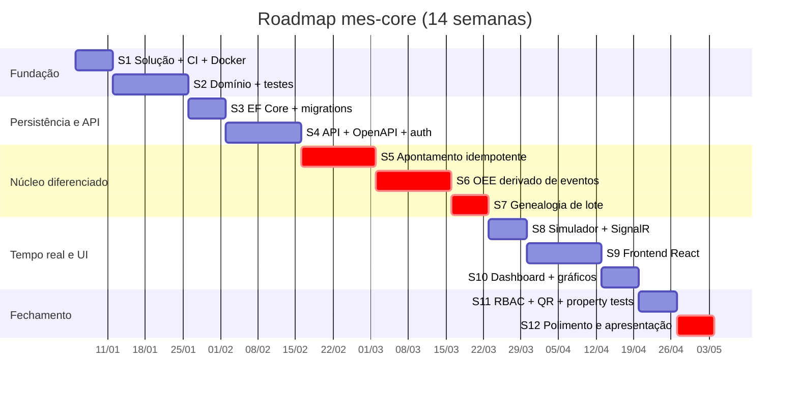

Os três sprints em destaque (S5, S6, S7) são o **núcleo de diferenciação**. Se o
tempo apertar, corte S10 e reduza S9 — nunca corte S5, S6 ou S7.

---

### Sprint 1 — Fundação: solução, CI e Docker

**Duração:** 1 semana · **Esforço:** 8–10 h

**Objetivo:** repositório vivo, com pipeline verde e `docker compose up` subindo
API vazia + Postgres. Nada de domínio ainda.

**Critério de pronto (verificável):**
- [ ] `git clone && docker compose up` → `GET http://localhost:8080/health` responde `200`
- [ ] `dotnet build` sem warnings (`TreatWarningsAsErrors=true`)
- [ ] Badge do GitHub Actions verde no README
- [ ] `docs/adr/0001-*.md` commitado

**Onde mexer:**
```
MesCore.sln
Directory.Build.props                       # Nullable, LangVersion, TreatWarningsAsErrors
.editorconfig
src/Mes.Domain/Mes.Domain.csproj            # vazio, sem dependências
src/Mes.Application/Mes.Application.csproj
src/Mes.Infrastructure/Mes.Infrastructure.csproj
src/Mes.Api/{Program.cs,Dockerfile,appsettings.json}
tests/Mes.Domain.UnitTests/                 # 1 teste trivial só para o CI ter o que rodar
docker-compose.yml
.github/workflows/ci.yml
README.md                                   # esqueleto
docs/adr/0001-modular-monolith-over-microservices.md
```

**O que você vai aprender neste estágio:**
- `Directory.Build.props` para configuração centralizada de múltiplos projetos
- Regra de dependência entre camadas e como o compilador a garante (`Domain` sem referência a nada)
- **Dockerfile multi-stage** para .NET (SDK para build, runtime `alpine` para execução) e por que a imagem final é ~5× menor
- `depends_on` + `healthcheck` no Compose, e o bug clássico de a API subir antes do banco
- Sintaxe de GitHub Actions: jobs, steps, cache de NuGet, matriz
- `TreatWarningsAsErrors` e por que ele economiza revisão de código

**ADR do sprint:** `0001-modular-monolith-over-microservices.md` — por que um
monólito modular é a decisão correta neste tamanho, quais são os pontos de corte
naturais se algum dia precisasse dividir, e o que você deixaria de ganhar
adotando microserviços agora.

---

### Sprint 2 — Domínio puro e testes de domínio

**Duração:** 2 semanas · **Esforço:** 16–20 h

**Objetivo:** o coração do sistema, sem banco, sem HTTP. Máquina de estados
completa e `OeeCalculator` funcionando, com testes.

**Critério de pronto:**
- [ ] Matriz de transição do §10.1 implementada como tabela declarativa
- [ ] 48 casos de transição passando (teste parametrizado)
- [ ] `OeeCalculator.Calculate` implementado com **todos** os casos de borda do §17.3
- [ ] `MergeAndMeasure` implementado e testado
- [ ] Cobertura de `Mes.Domain` > 90%
- [ ] `dotnet test` roda em menos de 3 s (prova que não há I/O)

**Onde mexer:**
```
src/Mes.Domain/Common/{Entity,AggregateRoot,IDomainEvent,DomainException}.cs
src/Mes.Domain/WorkOrders/{WorkOrder,WorkOrderStatus,ProductionEntry,WorkOrderTransitions}.cs
src/Mes.Domain/WorkOrders/Events/ProductionEntryRecorded.cs
src/Mes.Domain/Downtimes/{DowntimeEvent,DowntimeReason}.cs
src/Mes.Domain/Oee/{OeeCalculator,OeeInput,OeeResult,TimeInterval,Shift}.cs
src/Mes.Domain/Resources/{Resource,ResourceState}.cs
src/Mes.Domain/Catalog/{Product,ScrapReason}.cs
src/Mes.Domain/Traceability/{Batch,BatchConsumption}.cs
tests/Mes.Domain.UnitTests/WorkOrders/WorkOrderTransitionTests.cs
tests/Mes.Domain.UnitTests/WorkOrders/RecordProductionTests.cs
tests/Mes.Domain.UnitTests/Oee/OeeCalculatorTests.cs
tests/Mes.Domain.UnitTests/Oee/TimeIntervalMergeTests.cs
tests/Mes.Domain.UnitTests/Builders/WorkOrderTestBuilder.cs
```

**O que você vai aprender neste estágio:**
- **Agregado e fronteira transacional** — por que `ProductionEntry` não tem repositório próprio
- **Invariante de domínio vs validação de entrada** — a distinção que aparece em toda entrevista de arquitetura
- Máquina de estados como **tabela**, não como cascata de `if`. `FrozenDictionary` do .NET
- **Função pura e injeção de tempo** (`IClock`) — por que `DateTime.UtcNow` dentro de regra de negócio é bug de testabilidade
- `record` e value objects em C#; `readonly` e imutabilidade
- Algoritmo de **merge de intervalos sobrepostos** (varredura linear, `O(n log n)` pela ordenação) — algoritmo clássico de entrevista, aqui com motivo real
- Testes parametrizados com `[Theory]` + `[MemberData]`
- Precisão numérica: `decimal` para quantidade, `double` para segundos, e por que não misturar

**ADR do sprint:** `0005-oee-derived-from-events.md` — por que o OEE não é uma
coluna. Inclua o contraste com "indicador digitado" e o benefício de apontamento
retroativo funcionar de graça.

> **Sprint mais importante do projeto.** É aqui que você constrói o que vai
> mostrar na tela em entrevista. Se um sprint merecer atrasar, é este — mas por
> qualidade, não por procrastinação.

---

### Sprint 3 — Persistência, migrations e seed

**Duração:** 1 semana · **Esforço:** 10–12 h

**Objetivo:** domínio persistido em Postgres, migrations versionadas, seed de
demonstração com nomes fictícios (§8.6).

**Critério de pronto:**
- [ ] `dotnet ef database update` cria todo o schema do §9
- [ ] Índice único `(work_order_id, idempotency_key)` existe
- [ ] Índice único parcial `UNIQUE (resource_id) WHERE ended_at IS NULL` existe
- [ ] `xmin` configurado como token de concorrência em `work_order`
- [ ] Seed popula 4 catálogos, 3 recursos, 5 OPs e um grafo de lotes de 3 níveis
- [ ] Primeiro teste com **Testcontainers** passando

**Onde mexer:**
```
src/Mes.Infrastructure/Persistence/MesDbContext.cs
src/Mes.Infrastructure/Persistence/Configurations/*.cs         # 1 por agregado
src/Mes.Infrastructure/Persistence/Migrations/                 # geradas
src/Mes.Infrastructure/Persistence/Repositories/*.cs
src/Mes.Infrastructure/Persistence/Seed/SeedData.cs
src/Mes.Application/Abstractions/{IWorkOrderRepository,IDowntimeRepository,IBatchRepository,IUnitOfWork,IClock}.cs
tests/Mes.Api.IntegrationTests/MesApiFixture.cs                # Testcontainers
```

**O que você vai aprender neste estágio:**
- **EF Core migrations** de ponta a ponta: `Add-Migration`, `Update-Database`, o que vai no `__EFMigrationsHistory`, e como reverter
- `IEntityTypeConfiguration<T>` — configuração por agregado em vez de um `OnModelCreating` gigante
- **`UseXminAsConcurrencyToken()`** — token de concorrência sem coluna, específico do Postgres
- **Índice único parcial** (`WHERE`) — recurso do Postgres que não existe no SQL Server; garante invariante no banco
- Mapeamento de coleção privada com `PropertyAccessMode.Field` (o domínio expõe `IReadOnlyList`, o EF escreve no campo)
- `timestamptz` vs `timestamp`, `DateTimeOffset` no .NET, e por que armazenar tudo em UTC
- **Testcontainers**: container efêmero por execução, `IAsyncLifetime` do xUnit, `Respawn` para limpar entre testes
- Convenção `snake_case` no banco com `UseSnakeCaseNamingConvention()`
- Índice composto e ordem de coluna: por que `(resource_id, started_at DESC)` e não o inverso

**ADR do sprint:** `0002-postgresql-over-oracle.md` — inclua `xmin`, índice
parcial, CTE recursiva e o requisito de `docker compose up`. Cite honestamente o
que você perde saindo do Oracle (a experiência que você já tem nele).

---

### Sprint 4 — API, OpenAPI e autenticação

**Duração:** 2 semanas · **Esforço:** 16–20 h

**Objetivo:** API navegável e autenticada. CRUDs de catálogo e ciclo de vida da OP
funcionando ponta a ponta pelo HTTP.

**Critério de pronto:**
- [ ] `/scalar` (ou `/swagger`) lista todos os endpoints com schemas corretos
- [ ] `POST /api/auth/login` devolve JWT válido; endpoints protegidos rejeitam sem token
- [ ] Ciclo completo pelo HTTP: criar OP → liberar → iniciar → encerrar
- [ ] `ProblemDetails` (RFC 9457) em todos os erros, com `traceId`
- [ ] `GET /api/work-orders/{id}/allowed-actions` funcionando
- [ ] ≥ 8 testes de integração passando

**Onde mexer:**
```
src/Mes.Api/Program.cs                                    # DI, auth, OpenAPI, ProblemDetails
src/Mes.Api/Endpoints/{CatalogEndpoints,WorkOrderEndpoints,AuthEndpoints}.cs
src/Mes.Api/Middleware/ProblemDetailsMiddleware.cs
src/Mes.Application/WorkOrders/{CreateWorkOrder,ReleaseWorkOrder,StartWorkOrder,CompleteWorkOrder}/
src/Mes.Application/Common/ValidationBehavior.cs
src/Mes.Infrastructure/Identity/{JwtTokenService,PasswordHasher}.cs
tests/Mes.Api.IntegrationTests/WorkOrderLifecycleTests.cs
```

**O que você vai aprender neste estágio:**
- **Minimal API**: `MapGroup`, `TypedResults`, filtros de endpoint, `WithOpenApi`
- **Vertical slice**: comando + handler + validator + endpoint na mesma pasta. Contraste direto com o `Repository.cs` duplicado do legado
- **FluentValidation** e onde termina a validação de entrada e começa a invariante de domínio
- **JWT**: emissão, claims, `ClaimsPrincipal`, `[Authorize]`, expiração, `Audience`/`Issuer`
- **RFC 9457 ProblemDetails** — formato padronizado de erro, e por que isso importa para quem consome sua API
- Geração de **OpenAPI** no .NET 10 e como o schema sai do tipo C#
- `WebApplicationFactory` para teste de integração pelo pipeline HTTP real
- Hash de senha correto (PBKDF2/Argon2id, salt, fator de trabalho) — e por que nunca SHA256 puro

**ADR do sprint:** `0003-light-cqrs-ef-write-dapper-read.md` — dois caminhos no
mesmo banco. Explique o que **não** é: não é event sourcing, não é banco de
leitura separado, não é projeção assíncrona. Delimitar é tão importante quanto justificar.

---

### Sprint 5 — Apontamento idempotente e concorrência ⭐

**Duração:** 2 semanas · **Esforço:** 18–22 h

**Objetivo:** o endpoint mais importante do projeto, com idempotência e
concorrência otimista provadas por teste.

**Critério de pronto:**
- [ ] `POST .../production-entries` com `Idempotency-Key` obrigatória
- [ ] Replay → `200` com corpo idêntico e **zero** efeito colateral
- [ ] Mesma chave + payload diferente → `409`
- [ ] Corrida de INSERT (`23505`) tratada como replay, nunca `500`
- [ ] Conflito de `xmin` → `409`, com retry de 3 tentativas no handler
- [ ] Teste de 20 requests concorrentes: totais fecham com a soma dos aceitos
- [ ] Todos os `422` da tabela do §22.4 cobertos por teste

**Onde mexer:**
```
src/Mes.Application/WorkOrders/RecordProductionEntry/{Command,Handler,Validator,Result}.cs
src/Mes.Application/Common/ConcurrencyRetryPolicy.cs
src/Mes.Domain/WorkOrders/WorkOrder.cs                   # RecordProduction + guardas WO-4/8/9
src/Mes.Api/Endpoints/WorkOrderEndpoints.cs              # + sub-recurso production-entries
src/Mes.Api/Middleware/IdempotencyKeyFilter.cs
src/Mes.Infrastructure/Persistence/Configurations/ProductionEntryConfiguration.cs
tests/Mes.Api.IntegrationTests/IdempotencyTests.cs
tests/Mes.Api.IntegrationTests/ConcurrencyTests.cs
```

**O que você vai aprender neste estágio:**
- **Idempotência de verdade**: escopo da chave, hash canônico de payload, o que entra e o que fica fora do hash
- Semântica correta de `200` vs `201` vs `409` vs `422` — e por que confundir isso quebra o cliente
- **Concorrência otimista** com `xmin`: como o `UPDATE ... WHERE xmin = @x` funciona, e o que "0 rows affected" significa
- Diferença entre **lost update, dirty read e write skew**
- Tratar `PostgresException.SqlState == "23505"` como caminho esperado, não como falha
- **Retry com backoff exponencial + jitter**, e quais exceções são retentáveis
- Escrever **teste concorrente** com `Task.WhenAll` que falha de forma determinística quando a implementação está errada
- Por que `IsolationLevel` default (`ReadCommitted`) é suficiente aqui, e quando não seria

**ADR do sprint:** `0004-idempotency-key-on-production-entry.md` — o mais valioso
dos cinco. Conte o problema real (operador clica duas vezes, coletor reenvia,
timeout de gateway) **antes** de apresentar a solução. Compare com a alternativa
de tabela `idempotency_record` separada e justifique a escolha.

> **Este sprint é a sua melhor história de entrevista.** Reserve tempo para fazer
> bem e para escrever o ADR com cuidado.

---

### Sprint 6 — OEE derivado de eventos, ponta a ponta ⭐

**Duração:** 2 semanas · **Esforço:** 16–20 h

**Objetivo:** endpoint de OEE alimentado por SQL, concordando com o calculador
puro, com todos os casos de borda cobertos.

**Critério de pronto:**
- [ ] `GET /api/resources/{id}/oee?from&to` retorna o payload do §22.6
- [ ] `IOeeQueryService` implementado em Dapper, parametrizado
- [ ] Teste `Oee_endpoint_matches_calculator` passando (SQL == C#)
- [ ] Casos de borda cobertos: planejado zero, sem produção, paradas sobrepostas, parada cruzando borda, parada aberta, retroativo, `P > 1`, ciclo ideal ausente
- [ ] `timeseries` e `downtime-pareto` funcionando
- [ ] Paradas: `POST /downtimes` (idempotente) e `POST /downtimes/{id}/close`

**Onde mexer:**
```
src/Mes.Application/Oee/GetResourceOee/{Query,Handler}.cs
src/Mes.Application/Oee/GetOeeTimeSeries/{Query,Handler}.cs
src/Mes.Application/Oee/GetDowntimePareto/{Query,Handler}.cs
src/Mes.Application/Downtimes/{StartDowntime,CloseDowntime}/
src/Mes.Application/Abstractions/IOeeQueryService.cs
src/Mes.Infrastructure/Queries/OeeQueryService.cs               # SQL do §17.7
src/Mes.Api/Endpoints/{OeeEndpoints,DowntimeEndpoints}.cs
tests/Mes.Api.IntegrationTests/OeeEndpointTests.cs
tests/Mes.Domain.UnitTests/Oee/OeeEdgeCaseTests.cs
```

**O que você vai aprender neste estágio:**
- **Dapper**: `QueryAsync<T>`, parâmetros, mapeamento para `record`, e quando ele bate LINQ
- **SQL de janela temporal**: interseção de intervalos em SQL, `COALESCE` para parada aberta, `LEAST`/`GREATEST`
- **Semiaberto `[from, to)`** e o bug de dupla contagem na borda — erro clássico de relatório
- Agregação com `GROUP BY` e ponderação por produto
- **`date_trunc` / `generate_series`** para bucket temporal na série histórica
- Como validar que duas implementações (SQL rápida, C# testada) concordam — a técnica que compra performance sem perder garantia
- Por que `occurred_at` e não `recorded_at` classifica na janela
- Ler **plano de execução** (`EXPLAIN ANALYZE`) e confirmar que o índice está sendo usado

**ADR do sprint:** revise e finalize `0005-oee-derived-from-events.md` com o que
você aprendeu implementando de verdade. ADR revisado depois da implementação é
sinal de honestidade intelectual — anote a data da revisão.

---

### Sprint 7 — Genealogia de lote e recall ⭐

**Duração:** 1 semana · **Esforço:** 10–14 h

**Objetivo:** rastreabilidade com CTE recursiva funcionando nos dois sentidos,
com guarda de ciclo.

**Critério de pronto:**
- [ ] `POST /api/batches/{id}/consumptions` com guardas de autoconsumo e ciclo
- [ ] `genealogy/backward` retorna ancestralidade multi-nível
- [ ] `genealogy/forward` e `recall-impact` retornam impacto sem duplicata
- [ ] Convergência de DAG vira `isReference: true`, não subárvore duplicada
- [ ] `maxDepth` respeitado
- [ ] Testes: grafo de 3 níveis com ramificação e diamante; ciclo rejeitado; P-9 (forward/backward inversas) passando

**Onde mexer:**
```
src/Mes.Application/Traceability/RegisterBatchConsumption/{Command,Handler}.cs
src/Mes.Application/Traceability/{GetBatchGenealogyBackward,GetBatchGenealogyForward,GetRecallImpact}/
src/Mes.Application/Traceability/GenealogyTreeBuilder.cs        # BuildTree do §18.4 — função pura
src/Mes.Application/Abstractions/IGenealogyQueryService.cs
src/Mes.Infrastructure/Queries/GenealogyQueryService.cs         # CTEs do §18.2 e §18.3
src/Mes.Api/Endpoints/TraceabilityEndpoints.cs
tests/Mes.Api.IntegrationTests/GenealogyTests.cs
tests/Mes.Domain.UnitTests/Traceability/GenealogyTreeBuilderTests.cs
```

**O que você vai aprender neste estágio:**
- **CTE recursiva**: `WITH RECURSIVE`, caso base, passo recursivo, `UNION ALL` vs `UNION`
- **Detecção de ciclo em SQL** com array de caminho (`path || x`, `NOT (x = ANY(path))`)
- **`DISTINCT ON`** do Postgres — sem equivalente direto em outros bancos
- **Modelagem de grafo em tabela relacional** e por que aresta como linha é melhor que campo `parent_id`
- Diferença entre **árvore e DAG**, e por que convergência exige tratamento explícito
- Por que o índice em `consumed_batch_id` é a diferença entre 50 ms e 30 s no recall
- Guarda de invariante na escrita vs na leitura (defesa em profundidade)
- Transformar resultado plano em estrutura aninhada — algoritmo com invariante de loop

**ADR do sprint:** parágrafo no README (não precisa de ADR novo) explicando a
escolha CTE recursiva vs recursão em memória, usando a tabela do §18.4. Ou
adicione como seção do `0003`.

---

### Sprint 8 — Simulador de equipamento e tempo real

**Duração:** 1 semana · **Esforço:** 10–12 h

**Objetivo:** o sistema se move sozinho. Worker publicando eventos pela API
pública e SignalR notificando.

**Critério de pronto:**
- [ ] `Mes.Simulator` sobe no Compose, autentica como conta de serviço, aponta produção periodicamente
- [ ] Simulador gera parada aleatória (MTBF/MTTR configuráveis) e a fecha
- [ ] Retry com Polly em `409`, **reusando a mesma `Idempotency-Key`**
- [ ] Hub `/hubs/shop-floor` autenticado, com grupos por recurso
- [ ] Eventos de domínio publicados **após** o commit
- [ ] Cliente de teste recebe `productionRecorded` em < 1 s

**Onde mexer:**
```
src/Mes.Simulator/{Program.cs,EquipmentSimulator.cs,SimulatorOptions.cs,Dockerfile}
src/Mes.Simulator/ApiClient.cs                                 # HttpClient + Polly
src/Mes.Api/Hubs/ShopFloorHub.cs
src/Mes.Infrastructure/Realtime/SignalRNotifier.cs
src/Mes.Application/Abstractions/IRealtimeNotifier.cs
src/Mes.Infrastructure/Persistence/MesDbContext.cs             # publicar eventos após SaveChanges
docker-compose.yml                                             # + service simulator
```

**O que você vai aprender neste estágio:**
- **`BackgroundService`** e `IHostedService`: ciclo de vida, `CancellationToken`, `PeriodicTimer`
- **`IHttpClientFactory`** e por que `new HttpClient()` esgota socket
- **Polly**: retry, backoff, jitter, circuit breaker — e quais status re-tentar
- **SignalR** server-side: hub, grupos, autenticação em WebSocket, `IHubContext` fora do hub
- **Publicação de evento de domínio após commit** — e o bug de notificar antes
- Simulação de falha: MTBF/MTTR, distribuição exponencial, gerador com semente fixa para reprodutibilidade
- Configuração por `IOptions<T>` + variável de ambiente + `appsettings` por ambiente
- Por que fazer o simulador passar pela API pública em vez de escrever no banco

---

### Sprint 9 — Frontend React: telas operacionais

**Duração:** 2 semanas · **Esforço:** 18–22 h

**Objetivo:** o operador consegue trabalhar. Login, lista/detalhe de OP,
apontamento e parada.

**Critério de pronto:**
- [ ] Login guarda o token, rotas protegidas redirecionam
- [ ] Tipos TS gerados do OpenAPI (`schema.d.ts`), **zero** tipo escrito à mão para DTO
- [ ] Lista de OPs com filtro; detalhe com botões derivados de `allowed-actions`
- [ ] Tela de apontamento: campos grandes, `Idempotency-Key` gerada uma vez e **reusada no retry**
- [ ] Tela de parada: abrir com motivo, fechar
- [ ] Erros de `ProblemDetails` renderizados de forma legível
- [ ] Teste Vitest provando o reuso da chave de idempotência no retry
- [ ] `web` sobe no Compose e conversa com a API

**Onde mexer:**
```
web/{package.json,vite.config.ts,tsconfig.json,Dockerfile,.env.example}
web/src/{main.tsx,App.tsx}
web/src/api/{client.ts,schema.d.ts}
web/src/api/hooks/{useWorkOrders,useProductionEntry,useDowntimes}.ts
web/src/auth/{AuthContext.tsx,RequirePermission.tsx}
web/src/pages/{LoginPage,WorkOrderListPage,WorkOrderDetailPage,ProductionEntryPage,DowntimePage,CatalogPage}.tsx
web/src/components/{StatusTransitionButtons,ProblemDetailsAlert}.tsx
web/tests/ProductionEntryPage.test.tsx
.github/workflows/ci.yml                                       # + job de front
```

**O que você vai aprender neste estágio:**
- **React moderno**: componentes de função, `useState`, `useEffect`, `useContext`, e por que hooks têm regras
- **TypeScript no front**: tipos gerados de contrato, `strict: true`, narrowing, tipos utilitários
- **TanStack Query**: `useQuery`, `useMutation`, chaves de cache, invalidação, `staleTime`, estados de loading/erro
- Por que **não** precisa de Redux quando o estado é quase todo do servidor
- **React Router**: rotas, rotas protegidas, params, navegação programática
- `openapi-typescript` — contrato compartilhado sem duplicação manual
- **Idempotência no cliente**: gerar a chave por intenção, não por request. O bug de gerar no retry
- **Vitest + React Testing Library**: testar comportamento (o que o usuário vê), não implementação
- Build de SPA em container (multi-stage: `node` para build, `nginx` para servir) e injeção de variável em runtime

> Este é o sprint fora da sua zona de conforto. Aceite que vai ser mais lento e
> resista a duas tentações: adicionar biblioteca para resolver desconforto de
> aprendizado, e refatorar o front antes dele funcionar.

---

### Sprint 10 — Dashboard, gráficos e tempo real na tela

**Duração:** 1 semana · **Esforço:** 10–12 h

**Objetivo:** a tela que vende o projeto. Abrir o dashboard e ver número se
movendo sozinho.

**Critério de pronto:**
- [ ] Cards de OEE por recurso: A × P × Q → OEE, com tooltip da fórmula e dos segundos
- [ ] Badge de estado do recurso (`Idle`/`Running`/`Down`) atualizando via SignalR
- [ ] Gráfico de OEE por hora (Recharts)
- [ ] Pareto de motivos de parada
- [ ] Reconexão automática do SignalR com indicador visual
- [ ] Telas de genealogia e recall: árvore expansível, `isReference` como link
- [ ] Simulador ligado → dashboard se move em < 30 s sem interação

**Onde mexer:**
```
web/src/realtime/{signalr.ts,useShopFloorEvents.ts}
web/src/pages/{DashboardPage,GenealogyPage,RecallPage}.tsx
web/src/components/{OeeCard,ResourceStateBadge,DowntimeParetoChart,GenealogyTree}.tsx
web/src/api/hooks/{useResourceOee,useGenealogy}.ts
```

**O que você vai aprender neste estágio:**
- **Cliente SignalR** em TypeScript: conexão, reconexão automática, ciclo de vida com `useEffect`
- Integrar push com cache: **evento invalida query**, não sobrescreve dado (padrão do §7)
- **Recharts**: composição declarativa, eixos, tooltip, responsividade
- Renderizar **árvore recursiva** em React (componente que se referencia) e por que precisa de `key` estável
- Visualização de indicador: por que mostrar A, P e Q separados vale mais que só o OEE
- Memoização (`useMemo`, `React.memo`) e quando ela realmente importa
- Design de UI para chão de fábrica: alvo de toque grande, contraste alto, informação hierarquizada

---

### Sprint 11 — RBAC, etiqueta QR e property-based testing

**Duração:** 1 semana · **Esforço:** 10–14 h

**Objetivo:** fechar as funcionalidades e escrever as propriedades — o diferencial
técnico.

**Critério de pronto:**
- [ ] `User`/`Role`/`Permission` com seed dos 3 papéis; autorização por **permissão**, não por papel
- [ ] Teste provando que `Operator` não consegue liberar OP (`403`)
- [ ] Frontend esconde ação sem permissão (e o servidor rejeita de qualquer forma)
- [ ] `GET /api/batches/{id}/label?format=png|svg` gera QR code
- [ ] **Mínimo 10 das 16 propriedades** do §25 implementadas e passando
- [ ] Projeto `Mes.Domain.PropertyTests` com gerador customizado
- [ ] Rate limit no login

**Onde mexer:**
```
src/Mes.Domain/Identity/{User,Role,Permission}.cs
src/Mes.Infrastructure/Identity/PermissionAuthorizationHandler.cs
src/Mes.Infrastructure/Labels/QrCodeGenerator.cs
src/Mes.Application/Labels/GenerateBatchQrCode/
src/Mes.Api/Program.cs                                         # policies + rate limiter
tests/Mes.Domain.PropertyTests/{OeeProperties,WorkOrderProperties}.cs
tests/Mes.Domain.PropertyTests/Generators/MesArbitraries.cs
tests/Mes.Api.IntegrationTests/{AuthorizationTests,IdempotencyTests}.cs
web/src/auth/RequirePermission.tsx
```

**O que você vai aprender neste estágio:**
- **Autorização baseada em permissão** com `IAuthorizationHandler` e `IAuthorizationRequirement` — por que é superior a checar papel no endpoint
- Modelagem RBAC: usuário → papéis → permissões, e onde a checagem acontece
- **Property-based testing**: a mudança de mentalidade de "que exemplo eu testo" para "que propriedade sempre vale"
- Escrever **gerador customizado** (`Arbitrary`) — o exercício que ensina o que é um input válido do seu domínio
- **Shrinking**: como o FsCheck reduz o contraexemplo ao mínimo, e por isso a falha é legível
- Geração de QR code, `IResult` binário, `Content-Type`, cache HTTP em imagem
- **Rate limiting** nativo do .NET (`AddRateLimiter`, janela fixa vs sliding vs token bucket)

> Quando uma propriedade falhar (e vai falhar), **guarde o contraexemplo**. Um
> parágrafo no README dizendo "a propriedade P-9 encontrou uma inversão de JOIN
> que 40 testes de exemplo não pegaram" é uma das coisas mais fortes que um
> portfólio Pleno pode conter.

---

### Sprint 12 — Polimento e apresentação

**Duração:** 1 semana · **Esforço:** 10–12 h

**Objetivo:** transformar código funcionando em portfólio que converte.

**Critério de pronto:**
- [ ] `README.md` completo: o que é, por que existe, domínio explicado para leigo, como rodar em 1 comando, arquitetura com diagrama Mermaid, decisões e tradeoffs, o que ficou fora e por quê
- [ ] `docs/domain-primer.md` — MES para quem nunca entrou numa fábrica
- [ ] 5 ADRs revisados e finalizados
- [ ] **GIF de 20–30 s** no topo do README: dashboard se movendo com o simulador
- [ ] 3–4 screenshots (dashboard, apontamento, genealogia, `/scalar`)
- [ ] `docker compose up` testado **em máquina limpa** (ou container Docker-in-Docker)
- [ ] CI verde, badges de build e cobertura
- [ ] `git log` limpo, `.gitignore` correto, **zero** `.bak`, zero segredo, zero dado real
- [ ] Post de LinkedIn escrito (§28.3)
- [ ] Repositório público e fixado no perfil do GitHub

**Onde mexer:**
```
README.md
docs/domain-primer.md
docs/adr/000{1..5}-*.md
docs/screenshots/{dashboard.png,production-entry.png,genealogy.png,openapi.png}
docs/demo.gif
LICENSE
.github/dependabot.yml
```

**O que você vai aprender neste estágio:**
- **Escrever README que converte**: hierarquia da informação, o primeiro parágrafo que decide se a pessoa continua lendo
- Traduzir decisão técnica em **valor de negócio** ("idempotência" → "operador clica duas vezes e não duplica produção")
- Gravar GIF de demonstração (ScreenToGif / LICEcap) e otimizar tamanho para o GitHub
- Auditar repositório antes de publicar: segredo, dado real, arquivo de build, histórico
- Escrever **ADR** — o formato (contexto, decisão, consequências, alternativas), que é usado de verdade em empresas grandes
- Comunicação técnica assíncrona, que é a habilidade mais valorizada em vaga remota internacional

### 26.3 Se o tempo apertar — ordem de corte

| Prioridade | Item | Corte |
|---|---|---|
| 🔒 Nunca | S5 idempotência, S6 OEE, S7 genealogia, S12 apresentação | São o projeto |
| 🔒 Nunca | Testes de domínio e property tests (mínimo 8 propriedades) | São o diferencial |
| ⚠️ Reduzir | S9 frontend | 4 telas em vez de 9. Catálogo pode ser só leitura |
| ⚠️ Reduzir | S10 dashboard | Cards de OEE sem gráfico histórico |
| ✂️ Cortar | Etiqueta QR (S11) | Bonito, não essencial |
| ✂️ Cortar | `timeseries` e Pareto (S6/S10) | O OEE pontual já demonstra o conceito |
| ✂️ Cortar | Deploy em nuvem | `docker compose up` é suficiente |

---

## 27. ADRs a escrever

Formato: 1 página, quatro seções — **Contexto**, **Decisão**, **Consequências**,
**Alternativas consideradas**. Em inglês. Escritos com suas palavras.

| # | Título | Sprint | Núcleo do argumento |
|---|---|---|---|
| 0001 | `modular-monolith-over-microservices` | S1 | Tamanho do sistema, custo operacional de distribuição, onde estão os pontos de corte se algum dia precisar dividir |
| 0002 | `postgresql-over-oracle` | S3 | `docker compose up` em 2 min, `xmin`, índice único parcial, CTE recursiva. O que se perde saindo do Oracle |
| 0003 | `light-cqrs-ef-write-dapper-read` | S4 | Invariante exige agregado; relatório exige SQL. O que **não** é: sem event sourcing, sem banco de leitura separado |
| 0004 | `idempotency-key-on-production-entry` | S5 | Problema real primeiro (clique duplo, reenvio de coletor, timeout). Chave no cliente, escopo, hash de payload, semântica HTTP. Alternativa: tabela separada |
| 0005 | `oee-derived-from-events` | S2/S6 | Indicador nunca é campo digitado. Custo: consulta mais caras. Benefício: auditável, apontamento retroativo de graça, explicável ao operador |

**Dica de redação:** um ADR bom descreve o que você **abriu mão**. "Escolhi X"
é fraco. "Escolhi X aceitando perder Y, porque neste contexto Z importa mais" é
uma frase de Pleno.

---

## 28. Como apresentar isso a um recrutador

### 28.1 Estrutura do README (ordem exata)

1. **Título + uma frase.** "A minimal Manufacturing Execution System core: work
   orders, idempotent production reporting, event-derived OEE and batch genealogy."
2. **Badges.** Build, testes, cobertura, licença.
3. **GIF de 20–30 s.** Dashboard se movendo. É o que decide se a pessoa continua.
4. **Why this project exists** (3–4 linhas). A narrativa do §1.2, em inglês, sem
   nome de empresa.
5. **Run it in one command.** `git clone`, `docker compose up`, três URLs
   (`localhost:5173`, `localhost:8080/scalar`, credenciais de demo). **Nesta
   posição**, antes de qualquer explicação longa. Quem avalia quer rodar.
6. **What a MES does** (para leigo). O parágrafo do §5, mais o link para
   `docs/domain-primer.md`.
7. **Architecture.** Diagrama C4 nível 2 em Mermaid + a regra de dependência entre camadas.
8. **The interesting parts.** Quatro blocos curtos, cada um com 3–5 linhas e link
   para o código:
   - *Idempotent production reporting* — o problema real, a chave, a semântica HTTP
   - *OEE derived from events, never stored* — a fórmula e os casos de borda
   - *Batch genealogy with recursive CTE* — recall forward e backward
   - *Optimistic concurrency with Postgres `xmin`* — o lost update evitado
9. **Testing strategy.** A pirâmide, e **as propriedades** com o contraexemplo que
   uma delas encontrou.
10. **Decisions and tradeoffs.** Links para os 5 ADRs, uma linha cada.
11. **What's intentionally out of scope.** A tabela do §4.2. Demonstra recorte.
12. **Screenshots.**
13. **Tech stack.** Lista simples, sem justificar (a justificativa está nos ADRs).

**Anti-padrões de README:** começar com lista de tecnologias; enterrar o "how to
run" no final; emoji em excesso; "🚀 Awesome MES System 🔥"; roadmap de features
que nunca serão feitas.

### 28.2 O que destacar no LinkedIn

**Headline:** `Software Engineer | .NET · React · Manufacturing Systems (MES/OT)`

A palavra **manufacturing** na headline é seu diferencial. Existem milhares de
devs .NET; poucos entendem chão de fábrica. Não esconda isso atrás de "Full Stack
Developer".

**Seção Projetos:**
> **MES Core — Manufacturing Execution System (portfolio project)**
> .NET 10 Web API · React + TypeScript · PostgreSQL · SignalR · Docker
> A minimal MES core built to study the architectural decisions behind the legacy
> system I work on daily: idempotent production reporting, OEE derived from
> events instead of stored fields, batch genealogy with recursive CTEs, and
> optimistic concurrency. Runs with a single `docker compose up`.
> Property-based tests cover OEE bounds, state-machine reachability and
> genealogy acyclicity.
> → github.com/<user>/mes-core

**Seção Sobre:** mencione os dois lados — sistema legado em produção (Oracle,
OPC, chão de fábrica) e stack moderna (API-first, React, testes, CI). A
combinação é rara e é o que te tira da pilha genérica.

### 28.3 Post de anúncio (modelo)

> Passei os últimos três meses reconstruindo o núcleo de um MES em .NET 10 e React.
>
> Trabalho com um MES legado em produção — ASP.NET MVC 5, Oracle, integração OPC
> com CLPs Siemens. Conheço as dores dele. Quis entender como essas decisões
> seriam tomadas hoje, então reconstruí o núcleo do zero.
>
> Três coisas que aprendi e não estavam no plano original:
>
> 1. **Idempotência não é padrão de livro, é necessidade de campo.** Operador
>    clica duas vezes. Coletor reenvia quando o Wi-Fi cai. Sem chave de
>    idempotência, isso vira produção fantasma e corrompe o indicador.
> 2. **OEE tem que ser derivado, nunca digitado.** No momento em que o indicador
>    é um campo, ele começa a divergir da realidade e ninguém consegue reconciliar.
>    Derivar de eventos custa consulta mais caras e paga com auditabilidade —
>    inclusive apontamento retroativo funciona de graça.
> 3. **Property-based testing encontra o que teste de exemplo não encontra.** Uma
>    propriedade que compara genealogia forward e backward pegou uma inversão de
>    JOIN que passava em todos os meus testes de exemplo.
>
> Sobe com um `docker compose up`. Código, ADRs e diagramas no repositório.
> Feedback é muito bem-vindo.
>
> #dotnet #react #manufacturing #MES #softwarearchitecture

Estrutura que funciona: aprendizado concreto no meio, link no fim, sem
superlativo, com convite a feedback.

### 28.4 As cinco perguntas de entrevista que este projeto habilita

**1. "Como você garante que uma operação não seja executada duas vezes num sistema distribuído?"**

Conte o problema antes da solução: operador clica duas vezes, coletor reenvia,
timeout de gateway. Depois a mecânica: chave gerada no **cliente** por intenção de
negócio, reusada em todo retry; escopo `(work_order_id, key)` com índice único;
hash do payload para detectar uso indevido; `201` na primeira, `200` no replay,
`409` se a chave foi reusada com payload diferente. Feche com o detalhe fino:
`unique violation 23505` é tratado como replay, não como erro — é o que faz a
implementação ser correta sob concorrência. Se ele puxar mais, entre em como
idempotência e `xmin` são complementares (§23.3).

**2. "Como você calcularia um indicador de eficiência de máquina?"**

Comece pela decisão, não pela fórmula: o indicador é **função pura de eventos**,
nunca campo persistido. Depois `OEE = A × P × Q` com cada termo definido. Então os
casos de borda, que é onde a conversa fica boa: tempo planejado zero devolve
`null`, não zero (distinção que o supervisor precisa); paradas sobrepostas exigem
**união** de intervalos, não soma; `occurred_at` classifica na janela, não
`recorded_at`, senão apontamento retroativo cai no período errado; janela
semiaberta `[from, to)` para não contar a borda duas vezes; performance acima de 1
é clampada **e sinalizada**, porque significa cadastro errado de tempo de ciclo.
Feche mencionando o teste que garante que a implementação SQL e a C# concordam.

**3. "Modele rastreabilidade de lote e explique como você faz um recall."**

`batch_consumption` como lista de arestas de um DAG. Backward é ancestralidade
(causa raiz), forward é impacto (recall). CTE recursiva nos dois sentidos, com
array de caminho para cortar ciclo e `maxDepth` como guarda. `DISTINCT ON` para
não duplicar em grafo com convergência — sem isso o relatório de recall mente
sobre o volume. Guarda de ciclo **na escrita** também, porque ciclo persistido
corrompe o significado do dado. E o índice em `consumed_batch_id`, que é a
diferença entre 50 ms e 30 s. Se ele perguntar por que não recursão em memória,
use a tabela do §18.4.

**4. "Dois usuários editam o mesmo registro ao mesmo tempo. O que acontece?"**

Descreva o lost update com a sequência concreta de quatro passos (§23.1) e o que
ele corrompe: o total da OP divergindo da soma dos apontamentos, silenciosamente.
Solução: concorrência otimista com `xmin` do Postgres — sem coluna extra, o banco
garante. `UPDATE ... WHERE xmin = @x`, zero linhas afetadas, `409`, retry com
backoff. Ponto alto: o retry só é seguro **porque** a chave de idempotência é a
mesma; senão o retry duplicaria quando a falha fosse de rede em vez de conflito.
Mostre que sabe quando pessimista seria melhor (contenção alta em recurso escasso,
transação longa) e por que aqui não é o caso.

**5. "Como você testa lógica de negócio complexa?"**

Três níveis, com peso proposital. Domínio puro sem I/O, roda em 3 s — o que só é
possível porque `IClock` é injetado e não há `DateTime.UtcNow` na regra.
Property-based para o que tem invariante matemática: OEE sempre em `[0,1]`, união
de intervalos sempre ≤ soma, N replays == 1 execução, genealogia forward e
backward são inversas. Integração com **Postgres real** via Testcontainers, porque
InMemory não tem índice único parcial, não tem CTE recursiva e não tem `xmin` — ou
seja, não testa nada do que é interessante. Feche com a máquina de estados como
tabela declarativa, gerando 48 casos automaticamente. E com o contraexemplo real
que uma propriedade encontrou.

### 28.5 Como falar do emprego atual sem violar a R4

**Pode:** "trabalho com um MES legado em produção", "ASP.NET MVC 5 em .NET
Framework com Oracle", "integração OPC DA com CLP Siemens", "cerca de 25 módulos
de planta", "criei funcionalidades nesse sistema", "os anti-padrões que vi lá
influenciaram este projeto — repositório duplicado por módulo, regra de negócio
dentro de package do banco".

**Não pode:** nome da empresa no repositório, nome real de tabela/package/área,
qualquer trecho de código, dado real, print com dado real, nome de produto ou
cliente.

**Frase pronta se perguntarem se é o mesmo sistema:**
> "Não. O sistema onde trabalho é propriedade da empresa e não reutilizei nada
> dele — nem código, nem nomenclatura, nem dado. Este projeto foi reconstruído a
> partir do conceito de MES, que é conhecimento público da indústria. O que trago
> da experiência é entender quais problemas realmente aparecem, como reenvio de
> apontamento e divergência de indicador."

Essa resposta, dada sem hesitação, comunica integridade — e integridade é
contratável.

---

## 29. Dependências (pacotes e versões)

Versões pinadas. Alinhar com a versão real do .NET 10 no momento da implementação.

### 29.1 Backend

```xml
<!-- Mes.Domain — ZERO pacotes externos. Isso é intencional e verificável. -->

<!-- Mes.Application -->
<PackageReference Include="FluentValidation" Version="12.0.0" />

<!-- Mes.Infrastructure -->
<PackageReference Include="Microsoft.EntityFrameworkCore" Version="10.0.0" />
<PackageReference Include="Npgsql.EntityFrameworkCore.PostgreSQL" Version="10.0.0" />
<PackageReference Include="EFCore.NamingConventions" Version="10.0.0" />
<PackageReference Include="Dapper" Version="2.1.66" />
<PackageReference Include="QRCoder" Version="1.6.0" />

<!-- Mes.Api -->
<PackageReference Include="Microsoft.AspNetCore.Authentication.JwtBearer" Version="10.0.0" />
<PackageReference Include="Microsoft.AspNetCore.OpenApi" Version="10.0.0" />
<PackageReference Include="Scalar.AspNetCore" Version="2.0.0" />
<PackageReference Include="Serilog.AspNetCore" Version="9.0.0" />
<PackageReference Include="Microsoft.EntityFrameworkCore.Design" Version="10.0.0" />

<!-- Mes.Simulator -->
<PackageReference Include="Microsoft.Extensions.Hosting" Version="10.0.0" />
<PackageReference Include="Microsoft.Extensions.Http.Resilience" Version="10.0.0" />

<!-- Testes -->
<PackageReference Include="xunit.v3" Version="2.0.0" />
<PackageReference Include="FluentAssertions" Version="7.0.0" />
<PackageReference Include="FsCheck.Xunit" Version="3.0.0" />
<PackageReference Include="Testcontainers.PostgreSql" Version="4.0.0" />
<PackageReference Include="Microsoft.AspNetCore.Mvc.Testing" Version="10.0.0" />
<PackageReference Include="Respawn" Version="6.2.1" />
<PackageReference Include="Bogus" Version="35.6.1" />
<PackageReference Include="coverlet.collector" Version="6.0.4" />
```

### 29.2 Frontend

```json
{
  "dependencies": {
    "react": "19.0.0",
    "react-dom": "19.0.0",
    "react-router-dom": "7.1.0",
    "@tanstack/react-query": "5.62.0",
    "@microsoft/signalr": "8.0.7",
    "recharts": "2.15.0"
  },
  "devDependencies": {
    "typescript": "5.7.2",
    "vite": "6.0.5",
    "@vitejs/plugin-react": "4.3.4",
    "vitest": "2.1.8",
    "@testing-library/react": "16.1.0",
    "@testing-library/user-event": "14.5.2",
    "openapi-typescript": "7.4.4",
    "eslint": "9.17.0",
    "tailwindcss": "3.4.17"
  }
}
```

### 29.3 Infraestrutura

| Componente | Versão / imagem |
|---|---|
| Runtime | `mcr.microsoft.com/dotnet/aspnet:10.0-alpine` |
| SDK (build) | `mcr.microsoft.com/dotnet/sdk:10.0` |
| Banco | `postgres:17-alpine` |
| Node (build do front) | `node:22-alpine` |
| Servidor do front | `nginx:1.27-alpine` |
| CI | `ubuntu-latest` (GitHub Actions) |

### 29.4 Ferramentas de apoio

| Ferramenta | Uso |
|---|---|
| `dotnet-ef` | Migrations (`dotnet tool restore` via `.config/dotnet-tools.json`) |
| `dotnet-format` | Formatação em pre-commit |
| ScreenToGif / LICEcap | GIF de demonstração para o README |
| Mermaid Live Editor | Iterar diagramas antes de commitar |
| Bruno / Insomnia | Coleção de requests commitada em `docs/api-collection/` |

---

## Encerramento

**A regra que resume tudo:** o valor deste projeto não está no número de telas.
Está em cinco decisões técnicas bem executadas e bem explicadas — idempotência,
OEE derivado, genealogia recursiva, concorrência otimista e testes por
propriedade — apresentadas por alguém que entende o domínio de manufatura por
dentro.

Um recrutador técnico gasta menos de 10 minutos no seu repositório. O GIF, o
`docker compose up` e os quatro parágrafos de "the interesting parts" são o que
ele vai ler. Todo o resto existe para sustentar esses dez minutos quando a
conversa técnica começar.
